## 一、项目整合与部署存在的问题

#### 1.1 SSM手动整合存在的问题

- SSM整合步骤多、配置繁琐

- 项目进行服务器部署步骤繁琐

#### 1.2 如何简化这些繁琐的配置和部署步骤？

- SpringBoot就是一个可以简化整合过程中复杂配置的框架

## 二、SpringBoot简介

#### 2.1 概念

- 随着动态语言的流行，Java语言的开发就显得格外笨重：配置繁琐、开发效率低、项目的部署变得复杂、集成第三方技术难度大。
- 在这种情况下，SpringBoot就应运而生。
- **SpringBoot采用了`习惯优于配置/约定大于配置`的理念快速的搭建项目的开发环境，我们无需或者进行很少的相关spring配置就能够快速的将项目运行起来**

#### 2.2 优点

- 能够快速的搭建项目
- 对主流的开发框架都提供了无配置集成（SpringBoot内置了配置）
- 项目可以独立运行、无需单独配置Servlet容器（内置了Tomcat）
- 极大提高了开发、部署效率
- 提供了运行时监控系统（日志等）
- 与云原生有天然的集成

#### 2.3 缺点

- 由于配置都是内置的，报错时定位比较困难
- 版本迭代速度比较快、有些版本改动还是比较大（增加学习成本）

## 三、第一个SpringBoot应用

> 体验：基于SpringBoot整合SpringMVC
>
> SpringBoot应用需要依赖远程服务器进行创建
>
> 远程服务器：
>
> - Spring官方：https://start.spring.io
> - ali：https://start.aliyun.com

#### 3.1 创建项目

###### 3.1 File---New---Project

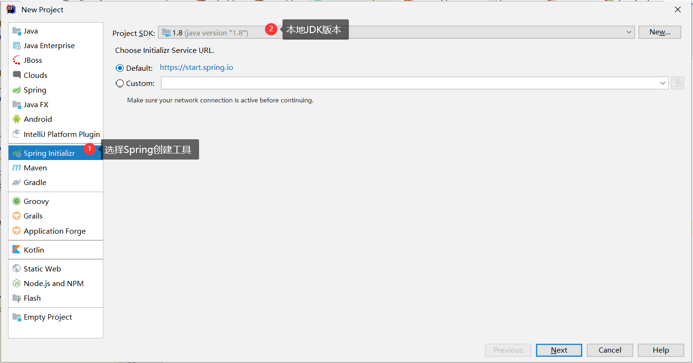

###### 3.2 填写项目信息

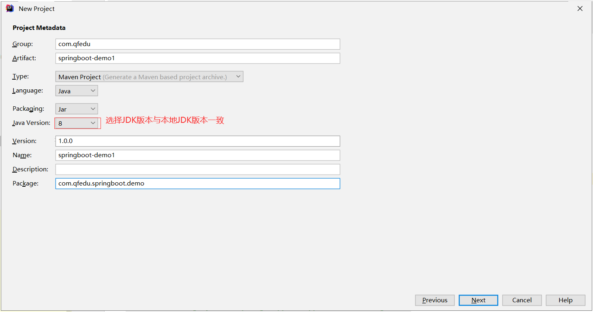

###### 3.3 选择项目依赖

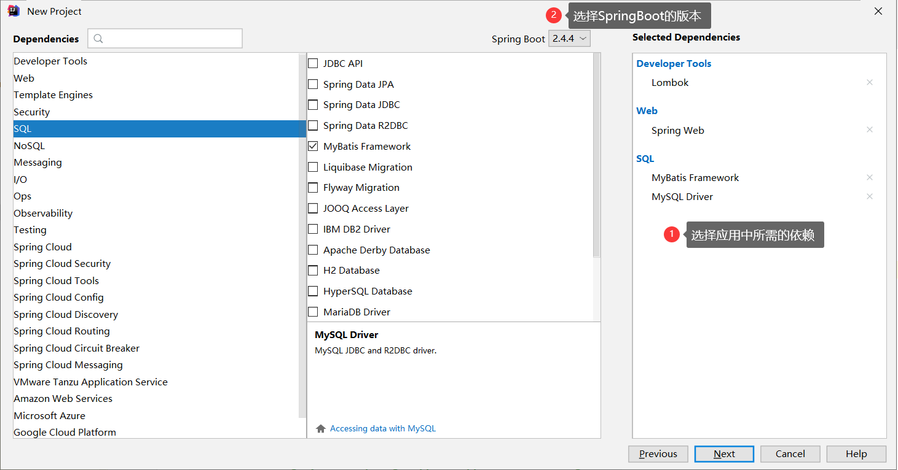

###### 3.4 选择项目存储目录

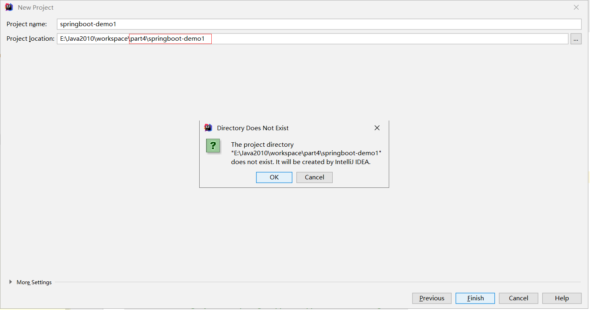

###### 3.5  网页创建SpringBoot应用

如果基于IDEA创建无法下载，可以基于网页版进行创建

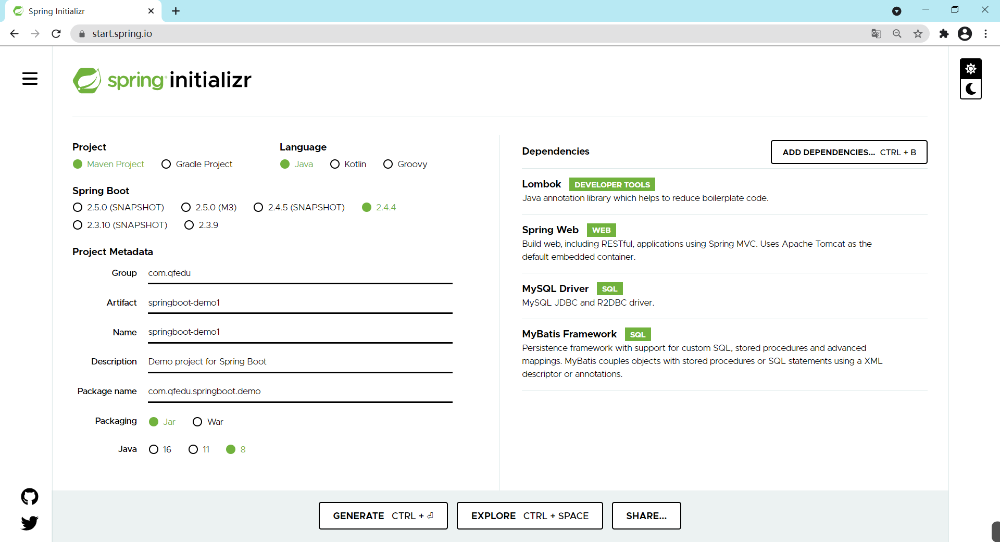

#### 3.2 配置项目

###### 3.2.1 应用项目结构

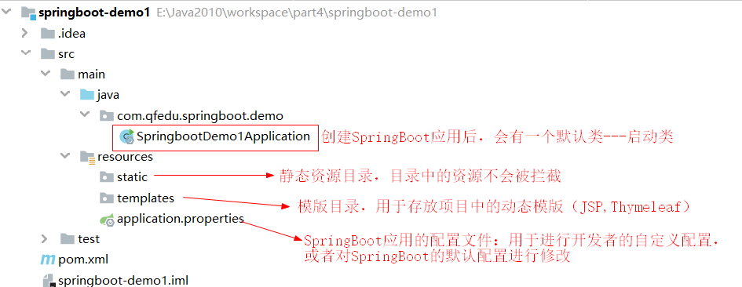

###### 3.2.2 自定义配置(整合MyBatis)

> SpringBoot帮助我们完成通用性配置，但是像数据库连接地址、账号、密码等还是需要手动完成配置

- 修改mysql驱动的版本（选择性）

- 在SpringBoot主配置文件`application.properties`文件中配置数据源及路径

  ```properties
  # 配置数据源  （key必须按照SpringBoot的要求）
  spring.datasource.driver-class-name=com.mysql.jdbc.Driver
  spring.datasource.url=jdbc:mysql://localhost:3306/db_2010_mybatis?characterEncoding=utf-8
  spring.datasource.username=root
  spring.datasource.password=admin123
  
  # 配置映射文件路径及实体类的包名
  mybatis.mapper-locations=classpath:mappers/*Mapper.xml
  mybatis.type-aliases-package=com.qfedu.springboot.demo.entity
  ```

- 在SpringBoot启动类通过`@MapperScan`注解指定DAO接口的包名

  ```java
  @SpringBootApplication
  @MapperScan("com.qfedu.springboot.demo.dao")
  public class SpringbootDemo1Application {
  
  	public static void main(String[] args) {
  		SpringApplication.run(SpringbootDemo1Application.class, args);
  	}
  
  }
  ```

#### 3.3 启动项目

###### 3.3.1 启动

> SpringBoot应用自带Servlet容器—Tomcat,因此无需进行额外的服务器配置，运行启动类即可启动一个SpringBoot应用

###### 3.3.2 测试

> 用户的注册功能

## 四、SpringBoot原理

#### 4.1 starter

> 一个starter就是一个开发场景的支持（ 依赖 + 配置）
>
> SpringBoot为我们提供了简化企业级开发绝大多数场景的支持（提供了多个starter），我们在进行项目开发的过程中只需引入对应的starter（创建SpringBoot应用时可选择），相关的依赖和配置就会被内置到项目中（消除人工配置）。

###### 4.1.1 starter依赖

> 一个starter依赖表示的不是一个依赖，而是某种开发环境所需的一组依赖

- Spring Web ---  `spring-boot-starter-web`
- MyBatis Framework --- `mybatis-spring-boot-starter`

###### 4.1.2 starter配置

> 一个starter不仅包含所需依赖，还包含了其所需的对应的配置

- MyBatis Framework --- `mybatis-spring-boot-starter`

  - 依赖：

    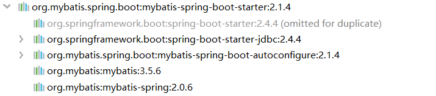

  - 配置：

    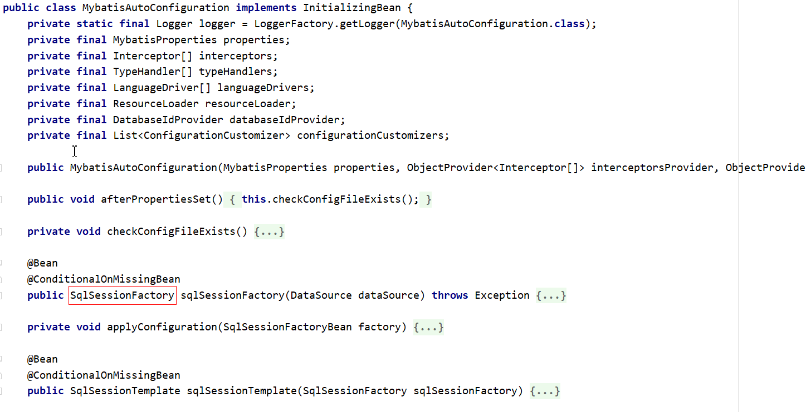

###### 4.1.3 案例

> 引入redis开发场景

- 添加starter依赖

```xml
<dependency>
    <groupId>org.springframework.boot</groupId>
    <artifactId>spring-boot-starter-data-redis</artifactId>
</dependency>
```

- 在service中可以直接注入redis客户端

```java
@Service
public class UserServiceImpl implements UserService {

    @Resource
    private UserDAO userDAO;

    @Resource
    private StringRedisTemplate stringRedisTemplate;
}
```


#### 4.2 SpringBoot应用的pom文件

###### 4.2.1 基于Spring官方服务器创建的SpringBoot应用

- 继承spring-boot-starter-parent.pom

```xml
<?xml version="1.0" encoding="UTF-8"?>
<project xmlns="http://maven.apache.org/POM/4.0.0" xmlns:xsi="http://www.w3.org/2001/XMLSchema-instance"
	xsi:schemaLocation="http://maven.apache.org/POM/4.0.0 https://maven.apache.org/xsd/maven-4.0.0.xsd">
	<modelVersion>4.0.0</modelVersion>
    
    <!-- SpringBoot应用中的pom 继承了spring-boot-starter-parent.pom -->
    <!-- spring-boot-starter-parent.pom又继承了spring-boot-dependencies.pom-->
    <!-- 在spring-boot-dependencies.pom已经对主流的框架的版本进行了声明 -->
	<parent>
		<groupId>org.springframework.boot</groupId>
		<artifactId>spring-boot-starter-parent</artifactId>
		<version>2.4.4</version>
		<relativePath/> 
	</parent>
	
</project>
```

- 引入了maven对springboot应用支持的插件 spring-boot

```xml
<build>
    <plugins>
        <plugin>
            <groupId>org.springframework.boot</groupId>
            <artifactId>spring-boot-maven-plugin</artifactId>
            <configuration>
                <mainClass>com.qfedu.springboot.demo.SpringbootDemo1Application</mainClass>
                <excludes>
                    <exclude>
                        <groupId>org.projectlombok</groupId>
                        <artifactId>lombok</artifactId>
                    </exclude>
                </excludes>
            </configuration>
        </plugin>
    </plugins>
</build>
```


###### 4.2.2 基于ali服务器创建的SpringBoot应用

```xml
<?xml version="1.0" encoding="UTF-8"?>
<project xmlns="http://maven.apache.org/POM/4.0.0" xmlns:xsi="http://www.w3.org/2001/XMLSchema-instance"
         xsi:schemaLocation="http://maven.apache.org/POM/4.0.0 https://maven.apache.org/xsd/maven-4.0.0.xsd">
    <modelVersion>4.0.0</modelVersion>
    <groupId>com.qfedu</groupId>
    <artifactId>springboot-demo2</artifactId>
    <version>1.0.0</version>
    <name>springboot-demo2</name>
    <description>Demo project for Spring Boot</description>

    <properties>
        <java.version>1.8</java.version>
        <project.build.sourceEncoding>UTF-8</project.build.sourceEncoding>
        <project.reporting.outputEncoding>UTF-8</project.reporting.outputEncoding>
<!--SpringBoot引用的pom没有继承spring-boot-starter-parent.pom，因此版本需要在当前pom中进行定义 -->
        <spring-boot.version>2.3.7.RELEASE</spring-boot.version>
    </properties>

    <build>
            <plugin>
                <groupId>org.springframework.boot</groupId>
                <artifactId>spring-boot-maven-plugin</artifactId>
                <version>2.3.7.RELEASE</version>
                <configuration>
                    <mainClass>com.qfedu.springboot.demo2.SpringbootDemo2Application</mainClass>
                </configuration>
                <executions>
                    <execution>
                        <id>repackage</id>
                        <goals>
                            <goal>repackage</goal>
                        </goals>
                    </execution>
                </executions>
            </plugin>
        </plugins>
    </build>

</project>

```


#### 4.3 Java配置方式

> 如果我们需要在SpringBoot应用中整合一种新的开发场景，只需在pom.xml引入对应的starter即可
>
> 一个starter不仅包含依赖，还包含相应的配置，starter中包含的配置都是通过Java类实现的——Java配置方式

###### 4.3.1 Spring版本发展

> 随着Spring版本的迭代，配置方式也在发生变化

- Spring 1.x
  - 所有的bean的配置只能通过xml完成
- Spring 2.x
  - 基于JDK1.5对注解的支持，Spring 2.x开始支持注解
  - 企业开发中到底是用xml配置还是用注解？
    - 对基础配置、引用的第三方依赖中的配置使用xml完成：例如数据源配置
    - 业务开发使用注解：例如controller、service
- Spring 3.x
  - Spring 开始提供基于Java的配置方式
- Spring 4.x
  - xml、注解、Java

###### 4.3.2 xml配置 

```xml
<!--applicationContext.xml-->
<bean id="stu" class="com.qfedu.beans.Student"></bean>
<bean id="date" class="java.util.Date"></bean>
```

###### 4.3.3 注解配置

```java
@Component
public class Student{
    
}
```

###### 4.3.4 Java配置方式

- 创建配置类

```java
@Configuration
public class SpringConfig{
    
    @Bean
    public Date getDate(){
        return new Date();
    }
}
```

配置类看起来比直接使用注解好像更麻烦，那为什么还要用配置类呢？

因为如果你想把一个第三方的类交给Spring管理呢，那用注解就必须得修改源码了，但是现在我们可以创建配置类来把比如Date类交给Spring管理，所以自定义类一般直接加注解就行了，不会放在配置类中，配置类中一般放第三方类

#### 4.4 SpringBoot自动配置


@ComponentScan：启动类只会扫描启动类所在的包和子包，所以我们写代码别写到其他包里面了，Spring是扫描不到的。

Spring.factories：包含的就是自动配置类的路径

#### 4.5 全局配置文件

> SpringBoot针对不同的开发场景提供默认的属性配置，如果默认的配置不能满足开发的需要，我们需要对属性配置进行修改
>
> 比如Redis就有默认配置，可以看一下Spring boot默认配置的文档，看一下有哪些默认配置

- SpringBoot应用提供了一个全局配置文件`application.properties`用于进行自定义配置

- 全局配置文件支持2中语法配置：
  - properties 键值对配置
  - yaml 语法的配置

###### 4.5.1 基于properties配置

```properties
# 配置数据源  （key必须按照SpringBoot的要求）
spring.datasource.driver-class-name=com.mysql.jdbc.Driver
spring.datasource.url=jdbc:mysql://localhost:3306/db_2010_mybatis?characterEncoding=utf-8
spring.datasource.username=root
spring.datasource.password=admin123

# 配置映射文件路径及实体类的包名
mybatis.mapper-locations=classpath:mappers/*Mapper.xml
mybatis.type-aliases-package=com.qfedu.springboot.demo.entity
```

###### 4.5.2 基于yaml配置

```yaml
spring:
  datasource:
    url: jdbc:mysql://localhost:3306/db_2010_mybatis?characterEncoding=utf-8
    driver-class-name: com.mysql.jdbc.Driver
    username: root
    password: admin123

mybatis:
  mapper-locations: classpath:mappers/*Mapper.xml
  type-aliases-package: com.qfedu.springboot.demo.entity
```

###### 4.5.3 常用的全局配置

```yaml
server:
  port: 9999
  servlet:
    context-path: /demo1
```


#### 4.6 自定义Banner

- 在SpringBoot应用启动的时候是有一个默认启动图案的
- 这个默认图案支持自定义配置
  - 在resources目录创建一个banner.txt
  - 在banner.txt文件中定义图案    http://patorjk.com/software/taag/

- 佛祖保佑

  ```
  ////////////////////////////////////////////////////////////////////
  //                          _ooOoo_                               //
  //                         o8888888o                              //
  //                         88" . "88                              //
  //                         (| ^_^ |)                              //
  //                         O\  =  /O                              //
  //                      ____/`---'\____                           //
  //                    .'  \\|     |//  `.                         //
  //                   /  \\|||  :  |||//  \                        //
  //                  /  _||||| -:- |||||-  \                       //
  //                  |   | \\\  -  /// |   |                       //
  //                  | \_|  ''\---/''  |   |                       //
  //                  \  .-\__  `-`  ___/-. /                       //
  //                ___`. .'  /--.--\  `. . ___                     //
  //              ."" '<  `.___\_<|>_/___.'  >'"".                  //
  //            | | :  `- \`.;`\ _ /`;.`/ - ` : | |                 //
  //            \  \ `-.   \_ __\ /__ _/   .-` /  /                 //
  //      ========`-.____`-.___\_____/___.-`____.-'========         //
  //                           `=---='                              //
  //      ^^^^^^^^^^^^^^^^^^^^^^^^^^^^^^^^^^^^^^^^^^^^^^^^^^        //
  //            佛祖保佑       永不宕机     永无BUG                   //
  ////////////////////////////////////////////////////////////////////
  ```

  

## 五、SpringBoot整合JSP

> SpringBoot应用默认支持的动态网页技术是Thymeleaf，并不支持JSP；因此在SpringBoot应用想要使用JSP需要通过手动整合来实现

#### 5.1 添加依赖

```xml
<dependency>
    <groupId>org.apache.tomcat.embed</groupId>
    <artifactId>tomcat-embed-jasper</artifactId>
    <version>9.0.45</version>
</dependency>
<dependency>
    <groupId>javax.servlet</groupId>
    <artifactId>jstl</artifactId>
    <version>1.2</version>
</dependency>
```

#### 5.2 创建JSP页面

- 修改pom文件打包方式为war

- 在main中创建webapp目录
- 在webapp创建.jsp页面

#### 5.3 将JSP页面放在WEB-INF中的访问

- 将JSP文件存放到WEB-INF目录

- 在application.yml文件配置SpringMVC视图解析方式：

  ```yaml
  spring:
    mvc:
      view:
        prefix: /WEB-INF/
        suffix: .jsp
  ```

- 创建PageController

  ```java
  @Controller
  public class PageController {
  
      @RequestMapping("/index.html")
      public String index() {
          return "index";
      }
  
  }
  ```

  

## 六、基于SpringBoot的SSM整合

#### 6.1 创建Springboot项目

- 创建项目时添加依赖

  - lombok
  - spring web
  - mysql driver
  - mybatis framework

- 修改mysql驱动的版本（可选）

  ```xml
  <!--pom.xml-->
  <properties>
      <java.version>1.8</java.version>
      <mysql.version>5.1.47</mysql.version>
  </properties>
  ```

#### 6.2 进行MyBatis所需的配置

- 将默认创建的application.properties后缀名修改为`yml`(根据习惯可选)

- 完成MyBatis的自定义配置

  ```yaml
  spring:
    datasource:
      driver-class-name: com.mysql.jdbc.Driver
      url: jdbc:mysql://localhost:3306/db_2010_mybatis?characterEncoding=utf-8
      username: root
      password: admin123
      
  mybatis:
    type-aliases-package: com.qfedu.springboot.ssm.beans
    mapper-locations: classpath:mappers/*Mapper.xml
  ```

#### 6.3 在启动类配置DAO扫描

- `@MapperScan`

```java
@SpringBootApplication
@MapperScan("com.qfedu.springboot.ssm.dao")
public class SpringbootSsmApplication {

    public static void main(String[] args) {
        SpringApplication.run(SpringbootSsmApplication.class, args);
    }

}
```

#### 6.4 整合Druid连接池

> 在SpringBoot中整合MyBatis的时候，默认集成了Hikari连接池，Hikari的效率比Druid要高，但是得益于Druid提供了比较便捷的监控系统在企业开发中，druid使用还是最多的。

###### 6.4.1 添加druid的starter

```xml
<dependency>
    <groupId>com.alibaba</groupId>
    <artifactId>druid-spring-boot-starter</artifactId>
    <version>1.1.10</version>
</dependency>
```

###### 6.4.2 配置druid数据源

```yaml
spring:
  datasource:
    druid:
      driver-class-name: com.mysql.jdbc.Driver
      url: jdbc:mysql://localhost:3306/db_2010_mybatis?characterEncoding=utf-8
      username: root
      password: admin123
      initial-size: 1
      min-idle: 1
      max-active: 20
```

## 七、Thymeleaf

> Thymeleaf是一种类似于JSP的动态网页技术

#### 7.1 Thymeleaf简介

- JSP 必须依赖Tomcat运行，不能直接运行在浏览器中
- HTML可以直接运行在浏览器中，但是不能接收控制器传递的数据
- Thymeleaf是一种既保留了HTML的后缀能够直接在浏览器运行的能力、又实现了JSP显示动态数据的功能——静能查看页面效果、动则可以显示数据

#### 7.2 Thymeleaf的使用

> SpringBoot应用对Thymeleaf提供了良好的支持

###### 7.2.1 添加thymeleaf的starter

```xml
<dependency>
    <groupId>org.springframework.boot</groupId>
    <artifactId>spring-boot-starter-thymeleaf</artifactId>
</dependency>
```

###### 7.2.2 创建Thymeleaf模板

> Thymeleaf模板就是HTML文件

- SpringBoot应用中 `resources\templates`目录就是用来存放页面模板的
- `重要说明：`
  
  - static 目录下的资源被定义静态资源，SpringBoot应用默认放行；如果将HTML页面创建static目录是可以直接访问的
- templates 目录下的文件会被定义为动态网页模板，SpringBoot应用会拦截templates中定义的资源；如果将HTML文件定义在templates目录，则必须通过控制器跳转访问。
  
- 在templates创建HTML页面模板

- 创建PageController，用于转发允许"直接访问"的页面请求

  ```java
  @Controller
  @RequestMapping("/page")
  public class PageController {
  
      @RequestMapping("/test.html")
      public String test(){
          return "test";
      }
  
  }
  ```

#### 7.3 Thymeleaf基本语法

> 如果要在thymeleaf模板中获取从控制传递的数据，需要使用th标签

###### 7.3.1 在thymeleaf模板页面引入th标签的命名空间

```html
<!DOCTYPE html>
<html lang="en" xmlns:th="http://www.thymeleaf.org">
    <head>
        <meta charset="UTF-8">
        <title>Title</title>
    </head>
    <body>


    </body>
</html>
```

###### 7.3.2 th:text

> 在几乎所有的HTML双标签都可以使用 th:text属性，将接收到的数据显示在标签的内容中

```html
<label th:text="${price}"></label>
<div th:text="${str}"></div>
<p th:text="${book.bookName}"></p>
```

###### 7.3.3 th:inline 内联

- HTML内联

  ```html
  <p th:inline="text">图书名称：[[${book.bookName}]]</p>
  ```

- CSS内联

  ```html
  <style type="text/css" th:inline="css">
      .style1{
          color:[[${color}]]
      }
  </style>
  ```

- JavaScript内联

  ```html
  <script type="css/javascript" th:inline="javascript">
     
  </script>
  ```

###### 7.3.4 th:object 和 *

```html
<div th:object="${book}">
    <p th:text="*{bookId}"></p>
    <p th:text="*{bookName}"></p>
    <p th:text="*{bookAuthor}"></p>
</div>
```

#### 7.4 流程控制

###### 7.4.1  th:each 循环

```html
<table style="width: 600px" border="1" cellspacing="0">
    <caption>图书信息列表</caption>
    <thead>
        <tr>
            <th>图书ID</th>
            <th>图书名称</th>
            <th>作者</th>
        </tr>
    </thead>
    <tbody>
        <tr th:each="b:${books}">
            <td th:text="${b.bookId}"></td>
            <td th:text="${b.bookName}"></td>
            <td th:text="${b.bookAuthor}"></td>
        </tr>
    </tbody>
</table>
```

###### 7.4.2 分支

- th:if 如果条件不成立，则不显示此标签

  ```html
  <td th:if="${b.bookPrice}>40" style="color:red">太贵！！！</td>
  <td th:unless="${b.bookPrice}>40" style="color:red">太贵！！！</td>
  
  <td th:if="${b.bookPrice}<=40" style="color:green">推荐购买</td>
  ```

- th:switch 和 th:case

  ```html
  <td th:switch="${b.bookPrice}/10">
      <label th:case="3">建议购买</label>
      <label th:case="4">价格合理</label>
      <label th:case="*">价格不合理</label>
  </td>
  ```

  ```html
  <td th:switch="${user.gender}">
      <label th:case="M">男</label>
      <label th:case="F">女</label>
      <label th:case="*">性别不详</label>
  </td>
  ```

#### 7.5 碎片使用

###### 7.5.1 碎片的概念

> 碎片，就是HTML片段，我们可以将多个页面中使用的相同的HTML标签部分单独定义，然后通过th:include可以在HTML网页中引入定义的碎片


###### 7.5.2 碎片使用案例

- 定义碎片  th:fragment

  - header.html

    ```html
    <!DOCTYPE html>
    <html lang="en" xmlns:th="http://www.thymeleaf.org">
    <head>
        <meta charset="UTF-8">
        <title>Title</title>
    </head>
    <body>
    
    <div th:fragment="fragment1" style="width: 100%; height: 80px;background: deepskyblue; color:white; font-size: 25px; font-family:文鼎霹雳体">
        千锋武汉Java2010班，六六六！！！
    </div>
    
    </body>
    </html>
    ```

  - footer.html

    ```html
    <!DOCTYPE html>
    <html lang="en"  xmlns:th="http://www.thymeleaf.org">
    <head>
        <meta charset="UTF-8">
        <title>Title</title>
    </head>
    <body>
    
    <div th:fragment="fragment2" style="width: 100%; height: 30px;background: lightgray; color:white; font-size: 16px;">
        千锋教育 武汉校区
    </div>
    
    </body>
    </html>
    ```

    

- 引用碎片  th:include 和 th:replace

  - a.html

    ```html
    <!DOCTYPE html>
    <html lang="en"  xmlns:th="http://www.thymeleaf.org">
    <head>
        <meta charset="UTF-8">
        <title>Title</title>
    </head>
    <body>
    
    <!--    <div th:include="header::fragment1"></div>-->
        <div th:replace="header::fragment1"></div>
    
        <div style="width: 100%; height: 500px">
            定义内容
        </div>
    
    <!--    <div th:include="footer::fragment2"></div>-->
        <div th:replace="footer::fragment2"></div>
    </body>
    </html>
    ```


## 八、SpringBoot应用的热部署配置

#### 8.1 热部署

项目首次部署、服务启动之后，如果应用发生了变化、而且IDEA感知到了应用的变化，就自动的完成jar的更新，无需手动再次启动服务器，就可以访问应用的更新。

#### 8.2 热部署配置

###### 8.2.1 IDE配置（idea）

- File---settings

  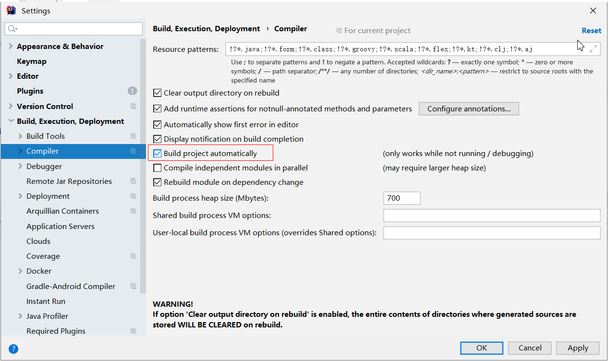

- Ctrl+Shift+Alt+/ ----- Registry

  | 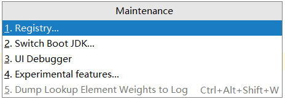 |
  | ---------------------------------------- |
  | 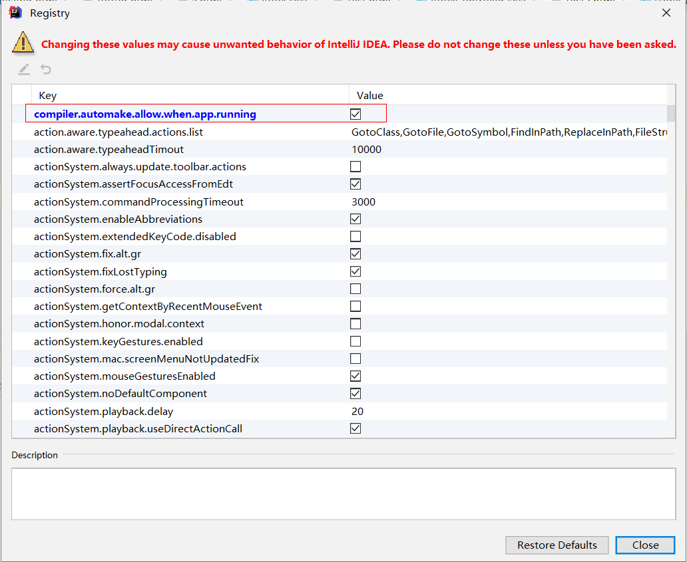 |

###### 8.2.2 SpringBoot项目配置

- 在需要进行热部署的SpringBoot应用中添加依赖

  ```xml
  <dependency>
      <groupId>org.springframework.boot</groupId>
      <artifactId>spring-boot-devtools</artifactId>
  </dependency>
  ```

- 配置SpringBoot的Maven插件

  ```xml
  <plugin>
      <groupId>org.springframework.boot</groupId>
      <artifactId>spring-boot-maven-plugin</artifactId>
      <configuration>
          <fork>true</fork>
      </configuration>
  </plugin>
  ```

- 配置SpringBoot应用的变化更新策略

  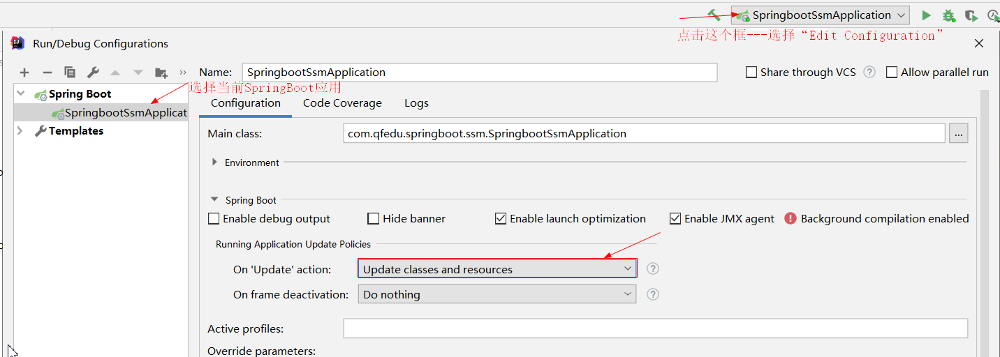