# 问题记录

数据库表设计阶段，为什么只创建逻辑外键，不创建物理外键？


数据库中一般作逻辑删除不会物理删除，即设个状态。


为什么只能用HTTP协议前后端交互，还有其他协议吗？


Springboot + MD5实现注册登陆密码加密


多线程的问题和Spring默认单例的联系


spring boot 2.6.0 使用swagger报 ‘documentationPluginsBootstrapper‘； java.lang.NullPointerException 错

原因
Springfox 假设 Spring MVC 的路径匹配策略是 ant-path-matcher，而 Spring [Boot](https://so.csdn.net/so/search?q=Boot&spm=1001.2101.3001.7020) 2.6.x版本的默认匹配策略是 path-pattern-matcher，这就造成了上面的报错。

https://blog.csdn.net/m0_46081442/article/details/121592487?spm=1001.2101.3001.6650.3&utm_medium=distribute.pc_relevant.none-task-blog-2%7Edefault%7EBlogCommendFromBaidu%7ERate-3.queryctrv4&depth_1-utm_source=distribute.pc_relevant.none-task-blog-2%7Edefault%7EBlogCommendFromBaidu%7ERate-3.queryctrv4&utm_relevant_index=5


在项目开发过程中DAO的实现问题

- 实体类和数据库表存在对应关系，并且是有规律的
- 所有实体的DAO接口中定义的方法也是有规律的，不同点就是实体类型不同

General DAO

```java
public interface GeneralDAO<T> {
  public int insert(T t);
  public T queryOneByPrimarykey(int i);
}
```

GoodsDAO

```java
public interface GoodsDAO extends GeneralDAO<Goods> {
  public int insert(Goods t);
  public Goods queryOneByPrimarykey(int i);
}
```


有工具来根据数据库表来生成实体类，而且会生成一个通用的DAO，就挺好

常规的CRUD就不用写了


## tkMapper

基于MyBatis提供了很多第三方插件，这些插件通常可以完成数据操作方法的封装（GeneralDAO）、数据库逆向工程工作（根据数据表生成实体类、生成映射文件）

- MyBatis-plus
- tkMapper

tkMapper就是一个MyBatis插件，是在MyBatis的基础上提供了很多工具，让开发变得简单，提高开发效率

- 提供了针对单表通用的数据库操作方法
- 逆向工程（根据数据表生成实体类、生成映射文件）


使用tkMapper

依赖

```xml
<dependency>
	<groupId>tk.mybatis</groupId>
  <artifactId>mapper-spring-boot-starter</artifactId>
  <version>2.1.5</version>
</dependency>
```

@MapperScan用tkMapper的不是Mybatis的，得改一下

Mapper已经完成了对单表的通用操作的封装，封装在Mapper接口和MysqlMapper接口，我们只需要自定义DAO接口然后继承这两个接口就行了

注意事项：

注意实体类的数据类型和名字啊，一般出错都是这个地方

别忘了加@Id不然MyBatis不知道主键是哪个字段


## 一、《锋迷商城》项目介绍

#### 1.1 项目背景

> 锋迷商城——电商平台
>
> - B2C 商家对客户
> - C2B2C 客户对商家对客户

###### 1.1.1 B2C

> 平台运营方即商品的卖家    小米商城
>
> - 商品
> - 用户

###### 1.1.2 C2B2C

> 平台运营方不卖商品（也可以卖）
>
> 卖家是平台的用户
>
> 买家也是平台用户
>
> - 用户（店铺）
> - 用户（买家）
> - 服务
> - 商品

###### 1.1.3 Java

> Java语言的应用领域很广，但主要应用于web领域的项目开发，web项目类型分为两类：
>
> - 企业级开发 （供企业内部使用的系统：企业内部的管理系统CRM\ERP、学校的教务管理系统）
> - 互联网开发（提供给所有互联网用户使用的系统——用户量）—— 电商


#### 1.2 项目功能

https://www.processon.com/view/link/606bde8b1e08534321fd2103


#### 1.3 技术选型

> SSM 企业开发框架    基础的开发技术

###### 1.3.1 单体项目

> 项目的页面和代码都在同一个项目，项目开发完成之后直接部署在一台服务器

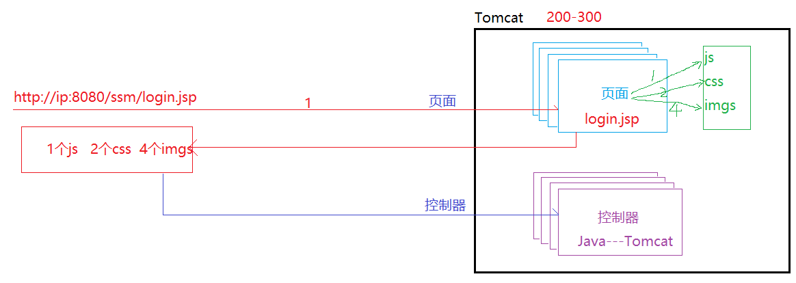

单体项目遇到的问题：用户对页面静态资源以及对Java代码的访问压力都会落在Tomcat服务器上。

###### 1.3.2 技术清单

- 项目架构：前后端分离
- 前端技术：vue、axios、妹子UI、layui、bootstrap
- 后端技术：SpringBoot+MyBatis、RESTful、swagger
- 服务器搭建：Linux、Nginx

## 二、项目架构的演进

#### 2.1 单体架构

- 前后端都部署在同一台服务器上（前后端代码都在同一个应用中）
- 缺点：对静态资源的访问压力也会落在Tomcat上

#### 2.2 前后端分离

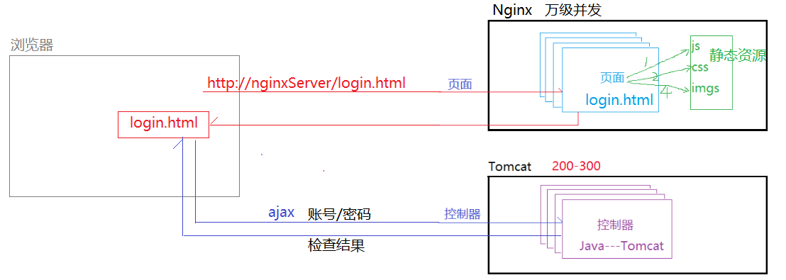

- 前后端分离：前端和后端分离开发和部署（前后端部署在不同的服务器）
- 优点：将对静态资源的访问和对接口的访问进行分离，Tomcat服务器只负责数据服务的访问

#### 2.3 集群与负载均衡

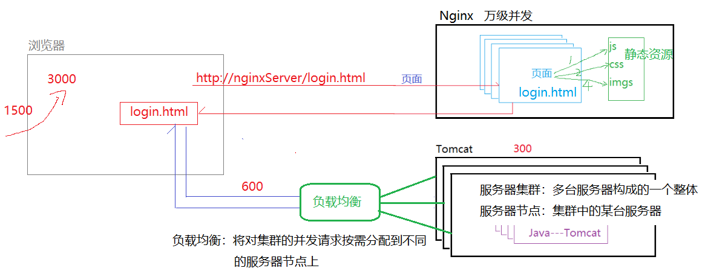

- 优点：提供并发能力、可用性

#### 2.4 分布式

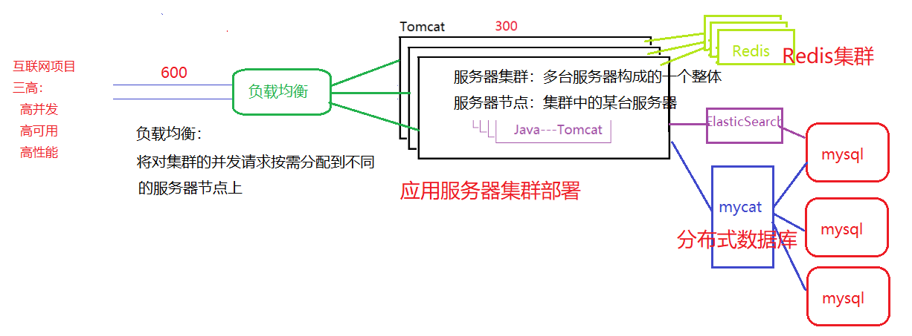

- 基于redis实现 分布式锁
- 分布式数据库mycat
- redis集群
- 数据库中间件
- 消息中间件

#### 2.5 微服务架构

- 微服务架构：将原来在一个应用中开发的多个模块进行拆分，单独开发和部署
- 保证可用性、性能

## 三、《锋迷商城》项目搭建

> 基于Maven的聚合工程完成项目搭建，前端采用vue+axios，后端使用SpringBoot整合SSM

#### 3.1 技术储备

- （√）SpringBoot： 实现无配置的SSM整合
- （√）Maven聚合工程：实现模块的复用


### 聚合工程


提取出公共的部分


dependency和dependency management的区别


#### 3.2 创建Maven聚合工程

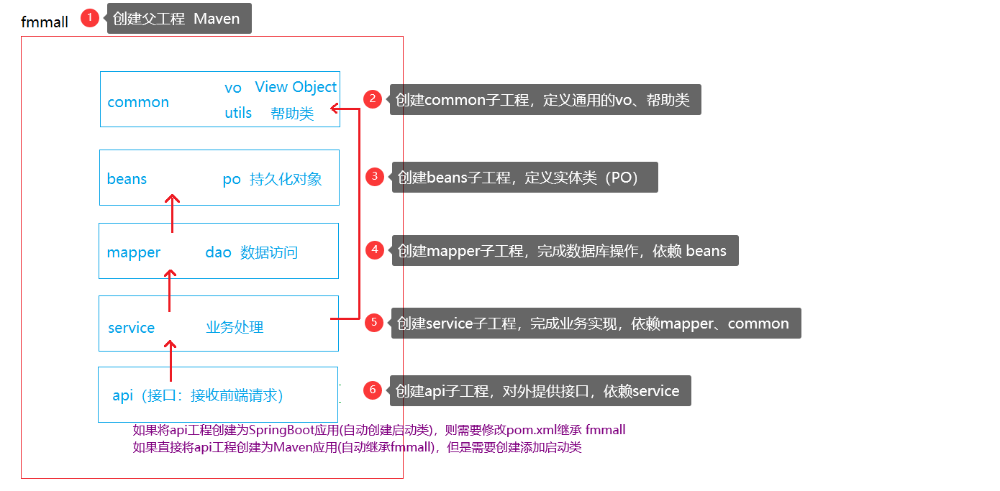

###### 3.2.1 构建父工程fmmall

- 创建一个maven工程、packing设置为 pom

- 父工程继承继承`spring-boot-starter-parent`

  ```xml
  <?xml version="1.0" encoding="UTF-8"?>
  <project xmlns="http://maven.apache.org/POM/4.0.0"
           xmlns:xsi="http://www.w3.org/2001/XMLSchema-instance"
           xsi:schemaLocation="http://maven.apache.org/POM/4.0.0 http://maven.apache.org/xsd/maven-4.0.0.xsd">
      <modelVersion>4.0.0</modelVersion>
  
      <!-- spring-boot-starter-parent -->
      <parent>
          <groupId>org.springframework.boot</groupId>
          <artifactId>spring-boot-starter-parent</artifactId>
          <version>2.4.4</version>
          <relativePath/> 
      </parent>
  
      <groupId>com.qfedu</groupId>
      <artifactId>fmmall</artifactId>
      <version>2.0.1</version>
  
      <packaging>pom</packaging>
  
  </project>
  ```

###### 3.2.2 创建common工程

- 选择fmmall，右键---New---Module （Maven工程）

- 修改common的pom.xml，设置packing=jar

  ```xml
  <?xml version="1.0" encoding="UTF-8"?>
  <project xmlns="http://maven.apache.org/POM/4.0.0"
           xmlns:xsi="http://www.w3.org/2001/XMLSchema-instance"
           xsi:schemaLocation="http://maven.apache.org/POM/4.0.0 http://maven.apache.org/xsd/maven-4.0.0.xsd">
      <parent>
          <artifactId>fmmall</artifactId>
          <groupId>com.qfedu</groupId>
          <version>2.0.1</version>
      </parent>
      <modelVersion>4.0.0</modelVersion>
  
      <artifactId>common</artifactId>
      <packaging>jar</packaging>
  
  </project>
  ```

###### 3.2.3 创建beans工程

- 选择fmmall，右键---New---Module （Maven工程）
- 修改beans的pom.xml，设置packing ----- jar

###### 3.2.4 创建mapper工程

- 选择fmmall，右键---New---Module （Maven工程）

- 修改mapper的pom.xml，设置packing ----- jar

- 在mapper的pom.xml，依赖beans

  ```xml
  <dependency>
      <groupId>com.qfedu</groupId>
      <artifactId>beans</artifactId>
      <version>2.0.1</version>
  </dependency>
  ```

###### 3.2.5 创建service工程

- 选择fmmall，右键---New---Module （Maven工程）

- 修改service的pom.xml，设置packing ----- jar

- 在service的pom.xml，依赖mapper、commom

  ```xml
  <dependency>
      <groupId>com.qfedu</groupId>
      <artifactId>mapper</artifactId>
      <version>2.0.1</version>
  </dependency>
  <dependency>
      <groupId>com.qfedu</groupId>
      <artifactId>common</artifactId>
      <version>2.0.1</version>
  </dependency>
  ```

###### 3.2.6 创建api工程

- 选择fmmall，右键---New---Module （SpringBoot工程）

- 修改api的pom.xml，继承fmmall，删除自己的groupId 和 version

  ```xml
  <parent>
      <groupId>com.qfedu</groupId>
      <artifactId>fmmall</artifactId>
      <version>2.0.1</version>
  </parent>
  ```

- 将spring boot的依赖配置到父工程fmmall的pom.xml

- 在父工程fmmall的pom.xml的modules添加api

  ```xml
  <!--fmmall  pom.xml-->
  <?xml version="1.0" encoding="UTF-8"?>
  <project xmlns="http://maven.apache.org/POM/4.0.0"
           xmlns:xsi="http://www.w3.org/2001/XMLSchema-instance"
           xsi:schemaLocation="http://maven.apache.org/POM/4.0.0 http://maven.apache.org/xsd/maven-4.0.0.xsd">
      <modelVersion>4.0.0</modelVersion>
  
      <parent>
          <groupId>org.springframework.boot</groupId>
          <artifactId>spring-boot-starter-parent</artifactId>
          <version>2.4.4</version>
          <relativePath/> <!-- lookup parent from repository -->
      </parent>
  
  
      <groupId>com.qfedu</groupId>
      <artifactId>fmmall</artifactId>
      <version>2.0.1</version>
      <modules>
          <module>common</module>
          <module>beans</module>
          <module>mapper</module>
          <module>service</module>
          <module>api</module>
      </modules>
      <packaging>pom</packaging>
  
  
      <properties>
          <java.version>1.8</java.version>
      </properties>
  
      <dependencies>
          <dependency>
              <groupId>org.springframework.boot</groupId>
              <artifactId>spring-boot-starter-web</artifactId>
          </dependency>
  
          <dependency>
              <groupId>org.projectlombok</groupId>
              <artifactId>lombok</artifactId>
              <optional>true</optional>
          </dependency>
          <dependency>
              <groupId>org.springframework.boot</groupId>
              <artifactId>spring-boot-starter-test</artifactId>
              <scope>test</scope>
          </dependency>
      </dependencies>
  
      <build>
          <plugins>
              <plugin>
                  <groupId>org.springframework.boot</groupId>
                  <artifactId>spring-boot-maven-plugin</artifactId>
                  <configuration>
                      <excludes>
                          <exclude>
                              <groupId>org.projectlombok</groupId>
                              <artifactId>lombok</artifactId>
                          </exclude>
                      </excludes>
                  </configuration>
              </plugin>
          </plugins>
      </build>
  
  
  </project>
  ```

- 在api中，依赖service

  ```xml
  <dependency>
      <groupId>com.qfedu</groupId>
      <artifactId>service</artifactId>
      <version>2.0.1</version>
  </dependency>
  ```

- api的pom.xml继承fmmall

#### 3.3 Maven聚合工程依赖分析

> 如果将依赖添加到父工程的pom中，根据依赖的继承关系，所有的子工程中都会继承父工程的依赖：
>
> - 好处：当有多个子工程都需要相同的依赖时，无需在子工程中重复添加依赖
>
> - 缺点：如果某些子工程不需要这个依赖，还是会被强行继承
>
>    
>
> 如果在父工程中没有添加统一依赖，则每个子工程所需的依赖需要在子工程的pom中自行添加
>
> 如果存在多个子工程需要添加相同的依赖，则需在父工程pom进行依赖版本的管理

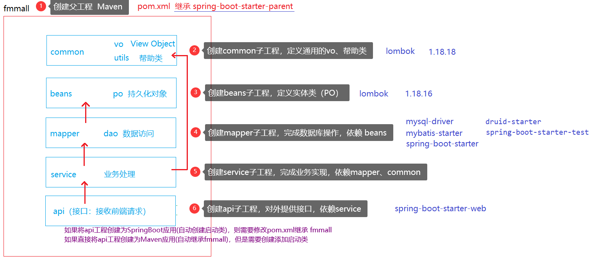

**`依赖配置说明`**

1. 在父工程的pom文件中一次性添加各个子工程所需的所有依赖
2. 在各个子工程中单独添加当前子工程的依赖

#### 3.4 整合MyBatis

###### 3.4.1 common子工程

- lombok

###### 3.4.2 beans子工程

- lombok

###### 3.4.3 MyBatis整合

- 在**mapper子工程**的pom文件，新增mybatis所需的依赖

  ```xml
  <!--mysql-->
  <dependency>
      <groupId>mysql</groupId>
      <artifactId>mysql-connector-java</artifactId>
      <version>5.1.47</version>
  </dependency>
  
  <!--spring-boot-starter-->
  <dependency>
      <groupId>org.springframework.boot</groupId>
      <artifactId>spring-boot-starter</artifactId>
      <version>2.4.4</version>
  </dependency>
  
  <!--mybatis starter-->
  <dependency>
      <groupId>org.mybatis.spring.boot</groupId>
      <artifactId>mybatis-spring-boot-starter</artifactId>
      <version>2.1.4</version>
  </dependency>
  ```

- 在**mapper子工程**的`resources`目录创建`application.yml`

  ```yaml
  spring:
    datasource:
      driver-class-name: com.mysql.jdbc.Driver
      url: jdbc:mysql://localhost:3306/db_2010_mybatis?characterEncoding=utf-8
      username: root
      password: admin123
  mybatis:
    mapper-locations: classpath:mappers/*Mapper.xml
    type-aliases-package: com.qfedu.fmmall.entity
  ```

- 在**api子工程**的启动类通过`@MpperScan`声明dao包的路径

  ```java
  @SpringBootApplication
  @MapperScan("com.qfedu.fmmall.dao")
  public class ApiApplication {
  
      public static void main(String[] args) {
          SpringApplication.run(ApiApplication.class, args);
      }
  
  }
  ```

#### 3.5 基于SpringBoot的单元测试

###### 3.5.1 添加依赖

```xml
<!--test starter-->
<dependency>
    <groupId>org.springframework.boot</groupId>
    <artifactId>spring-boot-starter-test</artifactId>
</dependency>

<dependency>
    <groupId>junit</groupId>
    <artifactId>junit</artifactId>
    <scope>test</scope>
</dependency>
```

###### 3.5.2 测试类

```java
@RunWith(SpringRunner.class)
@SpringBootTest(classes = ApiApplication.class)
public class UserDAOTest {

    @Resource
    private UserDAO userDAO;

    @Test
    public void queryUserByName() {
        User user = userDAO.queryUserByName("Lucy");
        System.out.println(user);
    }
}
```

#### 3.6 整合Druid

###### 3.6.1 添加依赖

- 在**mapper子工程**添加druid-starter

  ```xml
  <!--druid starter-->
  <dependency>
      <groupId>com.alibaba</groupId>
      <artifactId>druid-spring-boot-starter</artifactId>
      <version>1.1.22</version>
  </dependency>
  ```

###### 3.6.2 修改数据源配置

- 修改**mapper子工程**application.yml文件

  ```yaml
  spring:
    datasource:
      druid:
        driver-class-name: com.mysql.jdbc.Driver
        url: jdbc:mysql://localhost:3306/db_2010_mybatis?characterEncoding=utf-8
        username: root
        password: admin123
  mybatis:
    mapper-locations: classpath:mappers/*Mapper.xml
    type-aliases-package: com.qfedu.fmmall.entity
  ```

## 四、《锋迷商城》数据库设计


遵守数据库三范式

#### 4.1 软件开发步骤

- 问题定义/提出问题 
- 可行性分析（技术、成本、法律法规）
- 需求分析（需求采集、需求分析）---->甲方
- 概要设计
  - 架构设计（技术选型、架构模式、项目搭建）
  - 数据库设计
  - UI设计
  - 业务流程设计
- 详细设计
  - 实现步骤（业务流程的实现细节）

- 编码
  - 根据设计好的实现步骤进行代码实现
  - 开发过程中开发者要进行单元测试

- 测试
  - 集成测试
  - 功能测试（黑盒）
  - 性能测试（白盒）
- 交付/部署实施

#### 4.2 数据库设计流程

- 根据项目功能分析数据实体（数据实体，就是应用系统中要存储的数据对象）
  - 商品、订单、购物车、用户、评价、地址...
- 提取数据实体的数据项（数据对象的属性）
  - 商品(商品id、商品名称、商品描述，特征）
  - 地址(姓名、地址、电话...)
- 使用数据库设计三范式检查数据项是否合理
- 分析实体关系：E-R图
- 数据库建模（三线图）、建模工具
- 建库建表-SQL

#### 4.3 数据库设计分析

###### 4.3.1 PDMan建模工具使用

- 可视化创建数据表（数据表）

- 视图显示数据表之间的关系（关系图）

- 导出SQL指令（模型--导出DDL脚本）

- 记录数据设计的版本-数据库模型版本的管理（模型版本）

- 同步数据模型到数据库（开始-数据库连接）

  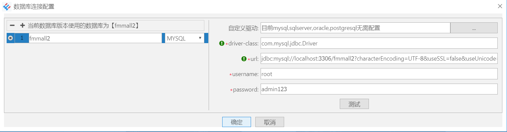

###### 4.3.2 分析《锋迷商城》的数据库模型

- 用户
- 首页

- 商品

- 购物车
- 订单 和 订单项
- 评论

#### 4.4 SPU 和 SKU

###### 4.4.1 SPU

> SPU(Standard Product Unit)：标准化产品单元。是商品信息聚合的最小单位，是一组可复用、易检索的标准化信息的集合，该集合描述了一个产品的特性。通俗点讲，属性值、特性相同的商品就可以称为一个SPU。

1    荣耀8   

2    小米10

###### 4.4.2 SKU

> [SKU](https://baike.baidu.com/item/SKU/5016808)（中文译为[最小存货单位](https://baike.baidu.com/item/最小存货单位/892217)，英文全称为Stock Keeping Unit,简称SKU，定义为保存库存控制的最小可用单位)

101      8G / 128G    10     1800     1

102      4G / 128G    20     1500     1

103      8G / 128G    12     2999     2

104      12G / 256G   11     3999     2

也就是说我们买的商品实际上是SPU的某一种SKU


订单


order这个表里面实际上关联的是地址和商品的快照，是不能与时机的地址和商品表关联的，因为订单里面的信息是不会改变的。


#### 4.5 建库建表

###### 4.5.1 创建数据表

- 从PDMan导出sql，导入到mysql

###### 4.5.2 准备测试数据

- 首页轮播图 index_img

  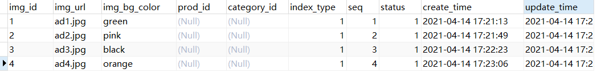

- 首页类别信息  category

  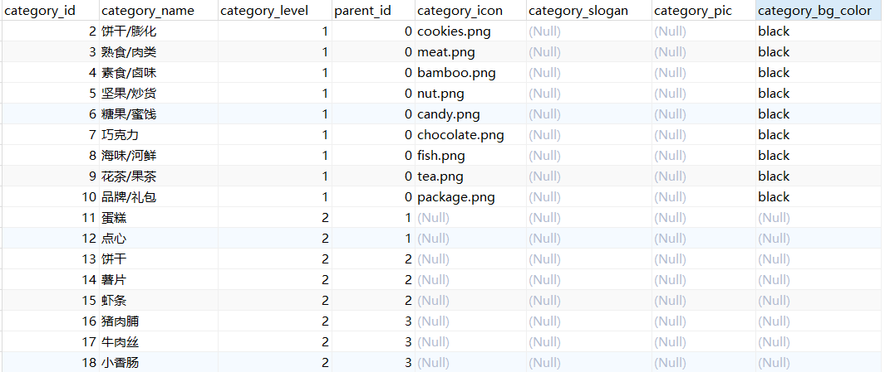

- 商品信息
- sku

## 五、《锋迷商城》业务流程设计-接口规范

> 在企业项目开发中，当完成项目的需求分析、功能分析、数据库分析与设计之后，项目组就会按照项目中的功能进行开发任务的分配

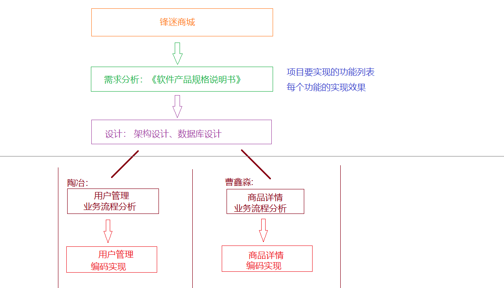

#### 5.1 前后端分离与单体架构流程实现的区别

>单体架构：页面和控制之间可以进行跳转，同步请求控制器，流程控制由的控制来完成
>
>前后端分离架构：前端和后端分离开发和部署，前端只能通过异步向后端发送请求，后端只负责接收请求及参数、处理请求、返回处理结果，但是后端并不负责流程控制，流程控制是由前端完成


前后端分离为什么采用异步请求而不是同步请求？


###### 5.1.1 单体架构

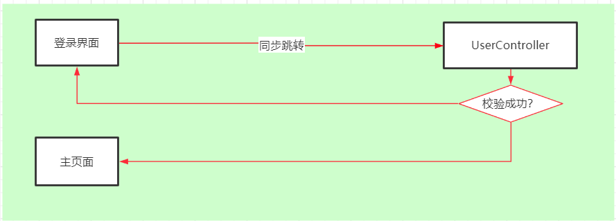

###### 5.1.2 前后端分离架构

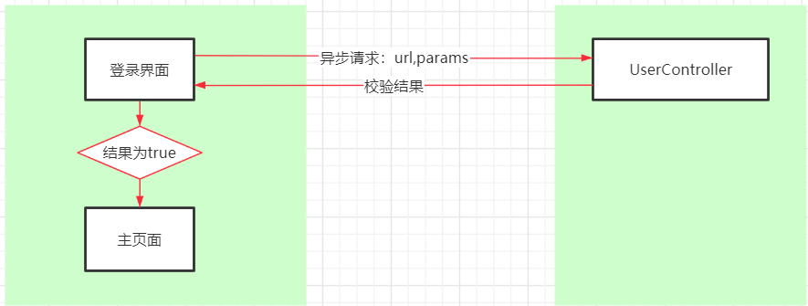


也就是说Controller不再做页面跳转流程控制了，只负责接收和返回数据，像数据判断然后根据结果跳转这些是前端来做了。

#### 5.2 接口介绍

###### 5.2.1 接口概念

> 狭义的理解：就是控制器中可以接受用户请求的某个方法
>
> 应用程序编程接口，简称API（Application Programming Interface），就是[软件]()系统不同[组成]()部分衔接的约定

###### 5.2.2 接口规范

> 作为一个后端开发者，我们不仅要完成接口程序的开发，还要编写接口的说明文档——接口规范

**接口规范示例**：

参考：[《锋迷商城》后端接口说明](《锋迷商城》后端接口说明.docx)

#### 5.3 Swagger

> 前后端分离开发，后端需要编写接口说明文档，会耗费比较多的时间
>
> swagger是一个用于生成服务器接口的规范性文档、并且能够对接口进行测试的工具

###### 5.3.1 作用

- 生成接口说明文档
- 对接口进行测试

###### 5.3.2  Swagger整合

- 在**api子工程**添加依赖（Swagger2 \ Swagger UI）

  ```xml
  <dependency>
      <groupId>io.springfox</groupId>
      <artifactId>springfox-swagger2</artifactId>
      <version>2.9.2</version>
  </dependency>
  
  <dependency>
      <groupId>io.springfox</groupId>
      <artifactId>springfox-swagger-ui</artifactId>
      <version>2.9.2</version>
  </dependency>
  ```

- 在**api子工程**创建swagger的配置（Java配置方式）

  ```java
  @Configuration
  @EnableSwagger2
  public class SwaggerConfig {
  
      /*swagger会帮助我们生成接口文档
      * 1：配置生成的文档信息
      * 2: 配置生成规则*/
  
      /*Docket封装接口文档信息*/
      @Bean
      public Docket getDocket(){
  
          //创建封面信息对象
          ApiInfoBuilder apiInfoBuilder = new ApiInfoBuilder();
          apiInfoBuilder.title("《锋迷商城》后端接口说明")
                  .description("此文档详细说明了锋迷商城项目后端接口规范....")
                  .version("v 2.0.1")
                  .contact( new Contact("亮哥","www.liangge.com","liangge@wang.com") );
          ApiInfo apiInfo =  apiInfoBuilder.build();
  
          Docket docket = new Docket(DocumentationType.SWAGGER_2)
                  .apiInfo(apiInfo) //指定生成的文档中的封面信息：文档标题、版本、作者
                  .select()
                  .apis(RequestHandlerSelectors.basePackage("com.qfedu.fmmall.controller"))
                  .paths(PathSelectors.any())
                  .build();
  
          return docket;
      }
  
  }
  ```

- 测试：
  
  - 启动SpringBoot应用，访问：http://localhost:8080/swagger-ui.html

###### 5.3.3 Swagger注解说明

> swagger提供了一套注解，可以对每个接口进行详细说明
>
> 因为很多时候还需要对接口进行解释，不然看不懂

`@Api` 类注解，在控制器类添加此注解，可以对控制器类进行功能说明

```java
@Api(value = "提供商品添加、修改、删除及查询的相关接口",tags = "商品管理")
```

`@ApiOperation`方法注解：说明接口方法的作用

`@ApiImplicitParams`和`@ApiImplicitParam` 方法注解，说明接口方法的参数

```java
@ApiOperation("用户登录接口")
@ApiImplicitParams({
    @ApiImplicitParam(dataType = "string",name = "username", value = "用户登录账号",required = true),
    @ApiImplicitParam(dataType = "string",name = "password", value = "用户登录密码",required = false,defaultValue = "111111")
})
@RequestMapping(value = "/login",method = RequestMethod.GET)
public ResultVO login(@RequestParam("username") String name,
                      @RequestParam(value = "password",defaultValue = "111111") String pwd){
    return userService.checkLogin(name,pwd);
}
```

`@ApiModel`和`@ApiModelProperty` 当接口参数和返回值为对象类型时，在实体类中添加注解说明

```java
@Data
@NoArgsConstructor
@AllArgsConstructor
@ApiModel(value = "User对象",description = "用户/买家信息")
public class User {

    @ApiModelProperty(dataType = "int",required = false)
    private int userId;

    @ApiModelProperty(dataType = "String",required = true, value = "用户注册账号")
    private String userName;

    @ApiModelProperty(dataType = "String",required = true, value = "用户注册密码")
    private String userPwd;

    @ApiModelProperty(dataType = "String",required = true, value = "用户真实姓名")
    private String userRealname;

    @ApiModelProperty(dataType = "String",required = true, value = "用户头像url")
    private String userImg;
}
```

`@ApiIgnore`接口方法注解，添加此注解的方法将不会生成到接口文档中

###### 5.3.4 Swagger-ui 插件

- 导入插件的依赖

  ```xml
  <dependency>
      <groupId>com.github.xiaoymin</groupId>
      <artifactId>swagger-bootstrap-ui</artifactId>
      <version>1.9.6</version>
  </dependency>
  ```

- 文档访问

  http://ip:port/doc.html

#### 5.4 RESTful

> 前后端分离开发的项目中，前后端之间是接口进行请求和响应，后端向前端提供请求时就要对外暴露一个URL；URL的设计不能是随意的，需要遵从一定的设计规范——RESTful

RESTful 是一种Web api的标准，也就是一种url设计风格/规范

- `每个URL请求路径代表服务器上的唯一资源`

  ```
  传统的URL设计：
  	http://localhost:8080/goods/delete?goodsId=1    商品1
      http://localhost:8080/goods/delete?goodsId=2    商品2
  
  RESTful设计：
  	http://localhost:8080/goods/delete/1    商品1
  	http://localhost:8080/goods/delete/2    商品2
  ```

  ```java
  @RequestMapping("/delete/{gid}")
  public ResultVO deleteGoods(@PathVariable("gid") int goodsId){
      System.out.println("-----"+goodsId);
      return new ResultVO(10000,"delete success",null);
  }
  ```

- `使用不同的请求方式表示不同的操作`

  > SpringMVC对RESTful风格提供了很好的支持，在我们定义一个接口的URL时，可以通过`@RequestMapping(value="/{id}",method=RequestMethod.GET)`形式指定请求方式，也可使用特定请求方式的注解设定URL
  >
  > `@PostMapping("/add")`
  >
  > `@DeleteMapping("/{id}")`
  >
  > `@PutMapping("/{id}")`
  >
  > `@GetMapping("/{id}")`

  - post   添加
  - get     查询
  - put     修改
  - delete 删除
  - option  (预检)

  ```java
  根据ID删除一个商品：
  //http://localhost:8080/goods/1   [delete]
  @RequestMapping(value = "/{id}",method = RequestMethod.DELETE)
  public ResultVO deleteGoods(@PathVariable("id") int goodsId){
      System.out.println("-----"+goodsId);
      return new ResultVO(10000,"delete success",null);
  }
  
  根据ID查询一个商品：
  //http://localhost:8080/goods/1    [get]
  @RequestMapping(value = "/{id}",method = RequestMethod.GET)
  public ResultVO getGoods(@PathVariable("id") int goodsId){
          return null;
  }
  ```

- `接口响应的资源的表现形式采用JSON（或者XML）`
  
- 在控制类或者每个接口方法添加`@ResponseBody`注解将返回的对象格式为json
  
- 或者直接在控制器类使用`@RestController`注解声明控制器
  
- `前端(Android\ios\pc)通过无状态的HTTP协议与后端接口进行交互`

## 六、《锋迷商城》设计及实现—用户管理

#### 6.1 实现流程

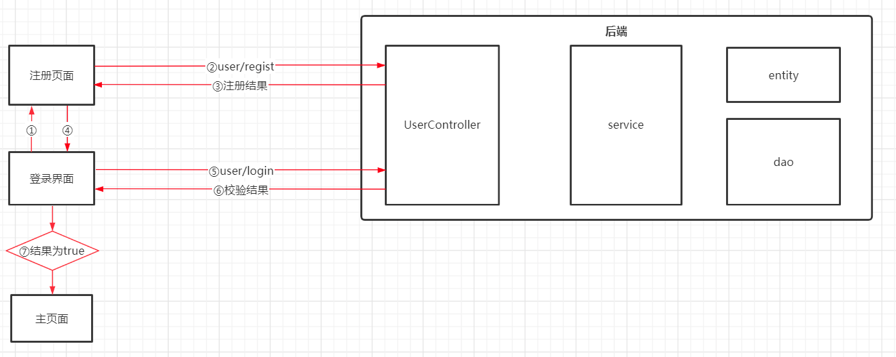

#### 6.2 后端接口开发

###### 6.2.1 完成DAO操作

1. 创建实体类

   ```java
   @Data
   @NoArgsConstructor
   @AllArgsConstructor
   @ApiModel(value = "User对象",description = "用户/买家信息")
   public class User {
       
       private int userId;
       private String username;
       private String password;
       private String nickname;
       private String realname;
       private String userImg;
       private String userMobile;
       private String userEmail;
       private String userSex;
       private Date userBirth;
       private Date userRegtime;
       private Date userModtime;
   
   }
   ```

2. 创建DAO接口、定义操作方法

   ```java
   public interface UserDAO {
   
       //用户注册
       public int insert(User user);
       
       //根据用户名查询用户信息
       public User query(String name);
   
   }
   ```

3. 创建DAO接口的mapper文件并完成配置

   ```xml
   <?xml version="1.0" encoding="UTF-8" ?>
   <!DOCTYPE mapper
           PUBLIC "-//mybatis.org//DTD Mapper 3.0//EN"
           "http://mybatis.org/dtd/mybatis-3-mapper.dtd">
   <mapper namespace="com.qfedu.fmmall.dao.UserDAO">
   
       <insert id="insertUser">
           insert into users(username,password,user_regtime,user_modtime)
           values(#{username},#{password},#{userRegtime},#{userModtime})
       </insert>
   
       <resultMap id="userMap" type="User">
           <id column="user_id" property="userId"/>
           <result column="username" property="username"/>
           <result column="password" property="password"/>
           <result column="nickname" property="nickname"/>
           <result column="realname" property="realname"/>
           <result column="user_img" property="userImg"/>
           <result column="user_mobile" property="userMobile"/>
           <result column="user_email" property="userEmail"/>
           <result column="user_sex" property="userSex"/>
           <result column="user_birth" property="userBirth"/>
           <result column="user_regtime" property="userRegtime"/>
           <result column="user_modtime" property="userModtime"/>
       </resultMap>
   
       <select id="queryUserByName" resultMap="userMap">
           select
               user_id,
               username,
               password,
               nickname,
               realname,
               user_img,
               user_mobile,
               user_email,
               user_sex,
               user_birth,
               user_regtime,
               user_modtime
           from users
           where username=#{name}
       </select>
   
   </mapper>
   ```

###### 6.2.2 完成Service业务

1. 创建service接口

   ```java
   public interface UserService {
   
       //用户注册
       public ResultVO userResgit(String name, String pwd);
   
       //用户登录
       public ResultVO checkLogin(String name, String pwd);
   
   }
   ```

2. 创建service接口实现类，完成业务实现

   这里需要加锁
   
   ```java
   @Service
   public class UserServiceImpl implements UserService {
   
       @Autowired
       private UserDAO userDAO;
   
       @Transactional
     //数据库的默认隔离级别是可重复读
     //要考虑用户在注册的时候会不会
       public ResultVO userResgit(String name, String pwd) {
           synchronized (this) {
               //1.根据用户查询，这个用户是否已经被注册
               User user = userDAO.queryUserByName(name);
   
               //2.如果没有被注册则进行保存操作
               if (user == null) {
                 //对密码加密
                   String md5Pwd = MD5Utils.md5(pwd);
                   user = new User();
                   user.setUsername(name);
                   user.setPassword(md5Pwd);
                 	user.setUserImg("img/default.png");
                   user.setUserRegtime(new Date());
                   user.setUserModtime(new Date());
                   int i = userDAO.insertUser(user);
                   if (i > 0) {
                       return new ResultVO(10000, "注册成功！", null);
                   } else {
                       return new ResultVO(10002, "注册失败！", null);
                   }
               } else {
                   return new ResultVO(10001, "用户名已经被注册！", null);
               }
           }
       }
   
       @Override
       public ResultVO checkLogin(String name, String pwd) {
           User user = userDAO.queryUserByName(name);
           if(user == null){
               return new ResultVO(10001,"登录失败，用户名不存在！",null);
           }else{
             //比较和判断加密后的密码
               String md5Pwd = MD5Utils.md5(pwd);
               if(md5Pwd.equals(user.getPassword())){
                   return new ResultVO(10000,"登录成功！",user);
               }else{
                   return new ResultVO(10001,"登录失败，密码错误！",null);
               }
           }
       }
   }
   ```

###### 6.2.3 完成Controller提供接口

1. 创建controller，调用service

2. 添加接口注解

    ```java
   @RestController
   @RequestMapping("/user")
   @Api(value = "提供用户的登录和注册接口",tags = "用户管理")
   public class UserController {
   
       @Resource
       private UserService userService;
   
   
       @ApiOperation("用户登录接口")
       @ApiImplicitParams({
               @ApiImplicitParam(dataType = "string",name = "username", value = "用户登录账号",required = true),
               @ApiImplicitParam(dataType = "string",name = "password", value = "用户登录密码",required = true)
       })
       @GetMapping("/login")
       public ResultVO login(@RequestParam("username") String name,
                             @RequestParam(value = "password") String pwd){
           ResultVO resultVO = userService.checkLogin(name, pwd);
           return resultVO;
       }
   
       @ApiOperation("用户注册接口")
       @ApiImplicitParams({
               @ApiImplicitParam(dataType = "string",name = "username", value = "用户注册账号",required = true),
               @ApiImplicitParam(dataType = "string",name = "password", value = "用户注册密码",required = true)
       })
       @PostMapping("/register")
       public ResultVO register(String username,String password){
           ResultVO resultVO = userService.userResgit(username, password);
           return resultVO;
       }
   
   }
   ```

###### 6.2.4 接口测试

- 基于swagger进行测试

#### 6.3 前端跨域访问

###### 6.3.1 跨域访问概念

- 什么时跨域访问？

  > AJAX 跨域访问是用户访问A网站时所产生的对B网站的跨域访问请求均[提交](https://baike.baidu.com/item/提交/2180896)到A网站的指定页面

  只要protocol, ip, port这三个有1个不同就是跨域，跨域是浏览器的一种保护机制
  
  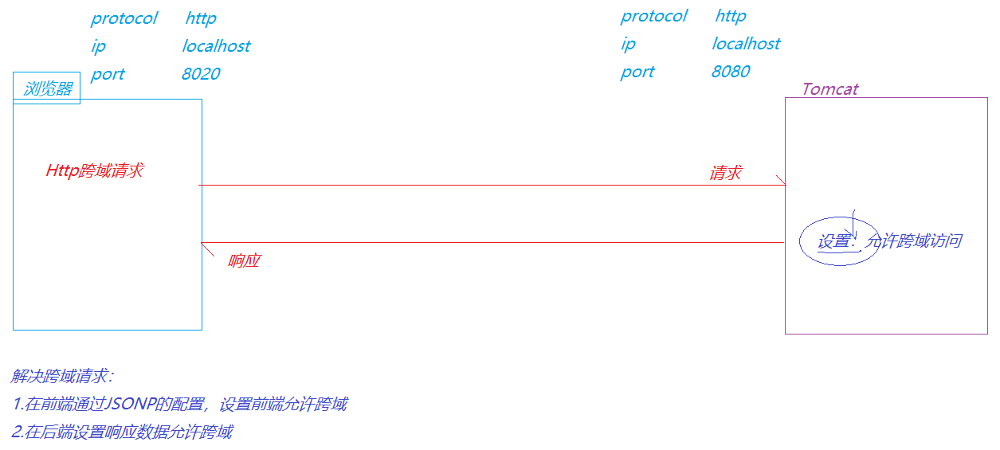

###### 6.3.2 如何解决跨域访问？

- 前端使用JSONP设置
- 后端使用`@CrossOrigin`  --- 就是设置响应头允许跨域

#### 6.4 前端页面之间的传值

###### 6.4.1 cookie

- 工具方法封装：

  ```javascript
  var operator = "=";
  
  function getCookieValue(keyStr){
  	var value = null;
  	var s = window.document.cookie;
  	var arr = s.split("; ");
  	for(var i=0; i<arr.length; i++){
  		var str = arr[i];
  		var k = str.split(operator)[0];
  		var v = str.split(operator)[1];
  		if(k == keyStr){
  			value = v;
  			break;
  		}
  	}
  	return value;
  }
  
  function setCookieValue(key,value){
  	document.cookie = key+operator+value;
  }
  ```

- A页面

  ```java
  setCookieValue("username",userInfo.username);
  setCookieValue("userimg",userInfo.userImg);
  ```

- B页面

  ```javascript
  var name = getCookieValue("username");
  var img = getCookieValue("userimg");
  ```

###### 6.4.2 localStorage

- A页面

  ```javascript
  localStorage.setItem("user",JSON.stringify(userInfo));
  ```

- B页面

  ```javascript
  var jsonStr = localStorage.getItem("user");
  var userInfo = eval("("+jsonStr+")");
  
  //移出localStorage键值对
  localStorage.removeItem("user");			
  ```


## 七、前后端分离用户认证-JWT

#### 7.1 基于session实现单体项目用户认证

> 在单体项目中如何保证受限资源在用户未登录的情况下不允许访问？

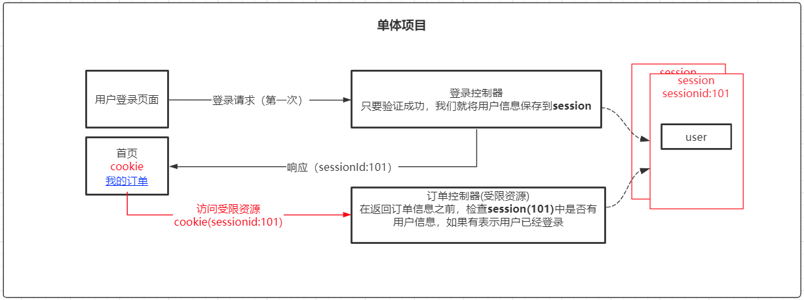

> 在单体项目中，视图资源（页面）和接口（控制器）都在同一台服务器，用户的多次请求都是基于同一个会话（session），因此可以借助session来进行用户认证判断：
>
> 1.当用户登录成功之后，将用户信息存放到session
>
> 2.当用户再次访问受限资源时，验证session中是否存在用户信息，可以根据session有无用户信息来判断用户是否登录

#### 7.2 基于token实现前后端分离用户认证

> 由于在前后端分离项目开发中，前后端之间是通过异步交互完成数据访问的，请求是无状态的，因此不能基于session实现用户的认证。

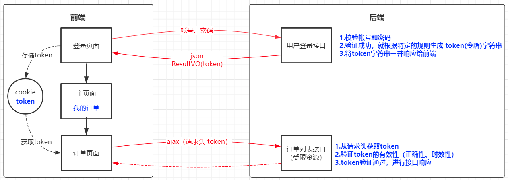

#### 7.3 基于token的用户认证的实现

###### 7.3.1 登录认证接口生成token

```java
// UserController
@GetMapping("/login")
public ResultVO login(@RequestParam("username") String name,
                      @RequestParam(value = "password") String pwd){
    ResultVO resultVO = userService.checkLogin(name, pwd);
    return resultVO;
}
```

```java
// UserServiceImpl
public ResultVO checkLogin(String name, String pwd) {
    Example example = new Example(Users.class);
    Example.Criteria criteria = example.createCriteria();
    criteria.andEqualTo("username", name);
    List<Users> users = usersMapper.selectByExample(example);

    if(users.size() == 0){
        return new ResultVO(ResStatus.NO,"登录失败，用户名不存在！",null);
    }else{
        String md5Pwd = MD5Utils.md5(pwd);
        if(md5Pwd.equals(users.get(0).getPassword())){
            //如果登录验证成功，则需要生成令牌token（token就是按照特定规则生成的字符串）
            String token = Base64Utils.encode(name+"QIANfeng6666");
            return new ResultVO(ResStatus.OK,token,users.get(0));
        }else{
            return new ResultVO(ResStatus.NO,"登录失败，密码错误！",null);
        }
    }
}
```

###### 7.3.2 登录页面接收到token存储到cookie

```javascript
// login.html
doSubmit:function(){
    if(vm.isRight){
        var url = baseUrl+"user/login";
        axios.get(url,{
            params:{
                username:vm.username,
                password:vm.password
            }
        }).then((res)=>{
            var vo = res.data;
            if(vo.code == 10000){
                //如果登录成功，就把token存储到cookie
                setCookieValue("token",vo.msg);

                window.location.href = "index.html";
            }else{
                vm.tips = "登录失败，账号或密码错误！";
            }
        });

    }else{
        vm.tips = "请正确输入帐号和密码！";
    }
}
```

###### 7.3.3 购物车页面加载时访问购物车列表接口

- 获取token
- 携带token访问接口

```html
<script type="text/javascript">
    var baseUrl = "http://localhost:8080/";

    var vm = new Vue({
        el:"#container",
        data:{
            token:""
        },
        created:function(){
            //当进入到购物车页面时，就要查询购物车列表（访问购物车列表接口）
            this.token = getCookieValue("token");
            console.log("token:"+this.token);
            axios({
                method:"get",
                url:baseUrl+"shopcart/list",
                params:{
                    token:this.token
                }
            }).then(function(res){
                console.log(res);
            });
        }
    });

</script>
```

###### 7.3.4 在购物车列表接口校验token

```java
@GetMapping("/list")
@ApiImplicitParam(dataType = "string",name = "token", value = "授权令牌",required = true)
public ResultVO listCarts(String token){
    //1.获取token
    //2.校验token
    if(token == null){
        return new ResultVO(ResStatus.NO,"请先登录",null);
    }else{
        String decode = Base64Utils.decode(token);
        if(decode.endsWith("QIANfeng6666")){
            //token校验成功
            return new ResultVO(ResStatus.OK,"success",null);
        }else{
            return new ResultVO(ResStatus.NO,"登录过期，请重新登录！",null);
        }
    }
}
```

#### 7.4 JWT

> 如果按照上述规则生成token：
>
> 1.简易的token生成规则安全性较差，如果要生成安全性很高的token对加密算法要求较高；
>
> 2.无法完成时效性的校验（登录过期）

###### 7.4.1 JWT简介

- JWT： Json Web Token

- 官网：https://jwt.io

- jwt的结构

  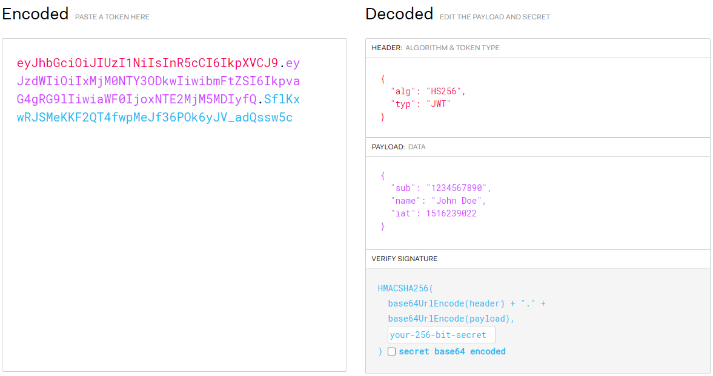

###### 7.4.2 生成JWT

- 添加依赖

  ```xml
  <dependency>
      <groupId>com.auth0</groupId>
      <artifactId>java-jwt</artifactId>
      <version>3.10.3</version>
  </dependency>
  
  <dependency>
      <groupId>io.jsonwebtoken</groupId>
      <artifactId>jjwt</artifactId>
      <version>0.9.1</version>
  </dependency>
  ```

- 生成token

  ```java
  String token = builder.setSubject(name)                 //主题，就是token中携带的数据
      .setIssuedAt(new Date())                            //设置token的生成时间
      .setId(users.get(0).getUserId() + "")               //设置用户id为token  id
      .setClaims(map)                                     //map中可以存放用户的角色权限信息
      .setExpiration(new Date(System.currentTimeMillis() + 24 * 60 * 60 * 1000)) //设置过期时间
      .signWith(SignatureAlgorithm.HS256, "QIANfeng6666")     //设置加密方式和加密密码
      .compact();
  ```

###### 7.4.3 JWT校验

- 如果token正确则正常解析，如果token不正确或者过期，则通过抛出的异常进行识别

  ```java
  try {
      //验证token
      JwtParser parser = Jwts.parser();
      parser.setSigningKey("QIANfeng6666"); //解析token的SigningKey必须和生成token时设置密码一致
      //如果token正确（密码正确，有效期内）则正常执行，否则抛出异常
      Jws<Claims> claimsJws = parser.parseClaimsJws(token);
      Claims body = claimsJws.getBody();  //获取token中用户数据
      String subject = body.getSubject(); //获取生成token设置的subject
      String v1 = body.get("key1", String.class); //获取生成token时存储的Claims的map中的值
  
      return new ResultVO(ResStatus.OK,"success",null);
  }catch (ExpiredJwtException e){
      return new ResultVO(ResStatus.NO,"登录过期，请重新登录！",null);
  }catch (UnsupportedJwtException e){
      return new ResultVO(ResStatus.NO,"Tonken不合法，请自重！",null);
  }catch (Exception e){
      return new ResultVO(ResStatus.NO,"请重新登录！",null);
  }
  ```

###### 7.4.4 拦截器校验Token

- 创建拦截器

  ```java
  @Component
  public class CheckTokenInterceptor implements HandlerInterceptor {
  
      @Override
      public boolean preHandle(HttpServletRequest request, HttpServletResponse response, Object handler) throws Exception {
  
          String token = request.getParameter("token");
          if(token == null){
              ResultVO resultVO = new ResultVO(ResStatus.NO, "请先登录！", null);
              //提示请先登录
              doResponse(response,resultVO);
          }else{
              try {
                  //验证token
                  JwtParser parser = Jwts.parser();
                  //解析token的SigningKey必须和生成token时设置密码一致
                  parser.setSigningKey("QIANfeng6666"); 
                  //如果token正确（密码正确，有效期内）则正常执行，否则抛出异常
                  Jws<Claims> claimsJws = parser.parseClaimsJws(token);
                  return true;
              }catch (ExpiredJwtException e){
                  ResultVO resultVO = new ResultVO(ResStatus.NO, "登录过期，请重新登录！", null);
                  doResponse(response,resultVO);
              }catch (UnsupportedJwtException e){
                  ResultVO resultVO = new ResultVO(ResStatus.NO, "Token不合法，请自重！", null);
                  doResponse(response,resultVO);
              }catch (Exception e){
                  ResultVO resultVO = new ResultVO(ResStatus.NO, "请先登录！", null);
                  doResponse(response,resultVO);
              }
          }
          return false;
      }
  
      private void doResponse(HttpServletResponse response,ResultVO resultVO) throws IOException {
          response.setContentType("application/json");
          response.setCharacterEncoding("utf-8");
          PrintWriter out = response.getWriter();
          String s = new ObjectMapper().writeValueAsString(resultVO);
          out.print(s);
          out.flush();
          out.close();
      }
  
  }
  ```

- 配置拦截器

  ```java
  @Configuration
  public class InterceptorConfig implements WebMvcConfigurer {
  
      @Autowired
      private CheckTokenInterceptor checkTokenInterceptor;
  
      @Override
      public void addInterceptors(InterceptorRegistry registry) {
          registry.addInterceptor(checkTokenInterceptor)
                  .addPathPatterns("/**")
                  .excludePathPatterns("/user/**");
      }
  }
  ```

#### 7.5 请求头传递token

> 前端但凡访问受限资源，都必须携带token发送请求；token可以通过请求行(params)、请求头（header）以及请求体（data）传递，但是习惯性使用header传递

###### 7.5.1 axios通过请求头传值

```javascript
axios({
    method:"get",
    url:baseUrl+"shopcart/list",
    headers:{
        token:this.token
    }
}).then(function(res){
    console.log(res);
});
```

###### 7.5.2 在拦截器中放行options请求

```java
@Component
public class CheckTokenInterceptor implements HandlerInterceptor {

    @Override
    public boolean preHandle(HttpServletRequest request, HttpServletResponse response, Object handler) throws Exception {
		//放行options请求
        String method = request.getMethod();
        if("OPTIONS".equalsIgnoreCase(method)){
            return true;
        }

        String token = request.getHeader("token");

        System.out.println("-------------"+token);
        if(token == null){
            ResultVO resultVO = new ResultVO(ResStatus.NO, "请先登录！", null);
            //提示请先登录
            doResponse(response,resultVO);
        }else{
            try {
                //验证token
                JwtParser parser = Jwts.parser();
                //解析token的SigningKey必须和生成token时设置密码一致
                parser.setSigningKey("QIANfeng6666"); 
                //如果token正确（密码正确，有效期内）则正常执行，否则抛出异常
                Jws<Claims> claimsJws = parser.parseClaimsJws(token);
                return true;
            }catch (ExpiredJwtException e){
                ResultVO resultVO = new ResultVO(ResStatus.NO, "登录过期，请重新登录！", null);
                doResponse(response,resultVO);
            }catch (UnsupportedJwtException e){
                ResultVO resultVO = new ResultVO(ResStatus.NO, "Token不合法，请自重！", null);
                doResponse(response,resultVO);
            }catch (Exception e){
                ResultVO resultVO = new ResultVO(ResStatus.NO, "请先登录！", null);
                doResponse(response,resultVO);
            }
        }
        return false;
    }

   private void doResponse(HttpServletResponse response,ResultVO resultVO) throws IOException {
        response.setContentType("application/json");
        response.setCharacterEncoding("utf-8");
        PrintWriter out = response.getWriter();
        String s = new ObjectMapper().writeValueAsString(resultVO);
        out.print(s);
        out.flush();
        out.close();
    }

}
```


## 八、首页—轮播图

#### 8.1 实现流程分析

- 流程图

  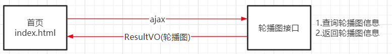

- 接口
  
  - 查询轮播图信息返回

#### 8.2 完成后台接口开发

###### 8.2.1 数据库操作实现

- 分析数据表结构

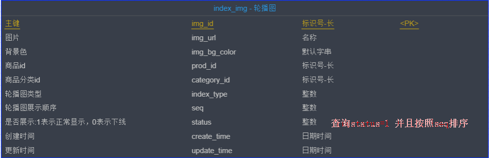

- 添加测试数据

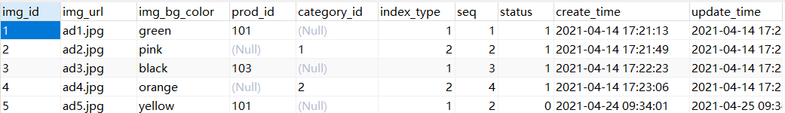

- 编写sql语句

```sql
    select img_id,
           img_url,
           img_bg_color,
           prod_id,
           category_id,
           index_type,
           seq,
           status,
           create_time,
           update_time
    from index_img
    where status=1
    order by seq
```

- 在Mapper接口（DAO）中定义操作方法

```java
public interface IndexImgMapper extends GeneralDAO<IndexImg> {

    //1.查询轮播图信息： 查询status=1 且 按照seq进行排序
    public List<IndexImg> listIndexImgs();

}
```

- 配置映射文件

```xml
<!--BaseResultMap是由逆向工程生成的-->
<select id="listIndexImgs" resultMap="BaseResultMap">
    select img_id,
           img_url,
           img_bg_color,
           prod_id,
           category_id,
           index_type,
           seq,
           status,
           create_time,
           update_time
    from index_img
    where status=1
    order by seq
  </select>
```

###### 8.2.2 业务层实现

- IndexImgService接口

```java
public interface IndexImgService {

    public ResultVO listIndexImgs();

}
```

- IndexImgServiceImpl实现类

```java
@Service
public class IndexImgServiceImpl implements IndexImgService {

    @Autowired
    private IndexImgMapper indexImgMapper;

    public ResultVO listIndexImgs() {
        List<IndexImg> indexImgs = indexImgMapper.listIndexImgs();
        if(indexImgs.size()==0){
            return new ResultVO(ResStatus.NO,"fail",null);
        }else{
            return new ResultVO(ResStatus.OK,"success",indexImgs);
        }
    }
}
```

###### 8.2.3 控制层实现

- IndexController类

```java
@RestController
@CrossOrigin
@RequestMapping("/index")
@Api(value = "提供首页数据显示所需的接口",tags = "首页管理")
public class IndexController {

    @Autowired
    private IndexImgService indexImgService;

    @GetMapping("/indeximg")
    @ApiOperation("首页轮播图接口")
    public ResultVO listIndexImgs(){
        return indexImgService.listIndexImgs();
    }

}
```


#### 8.3 完成前端功能

> 当进入到index.html，在进行页面初始化之后，就需要请求轮播图数据进行轮播图的显示

| index.html                               |
| ---------------------------------------- |
| 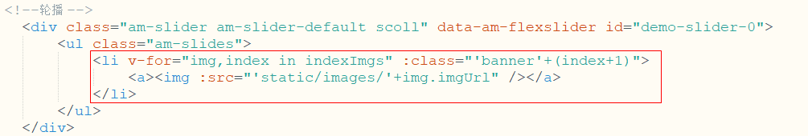 |
| 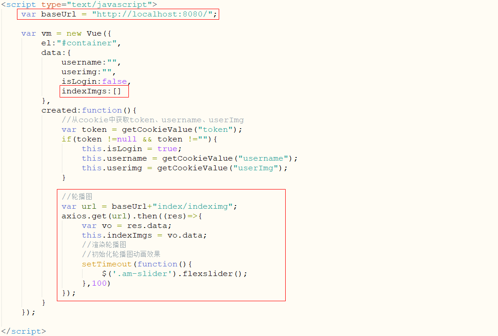 |

## 九、首页-分类列表

#### 9.1 实现流程分析

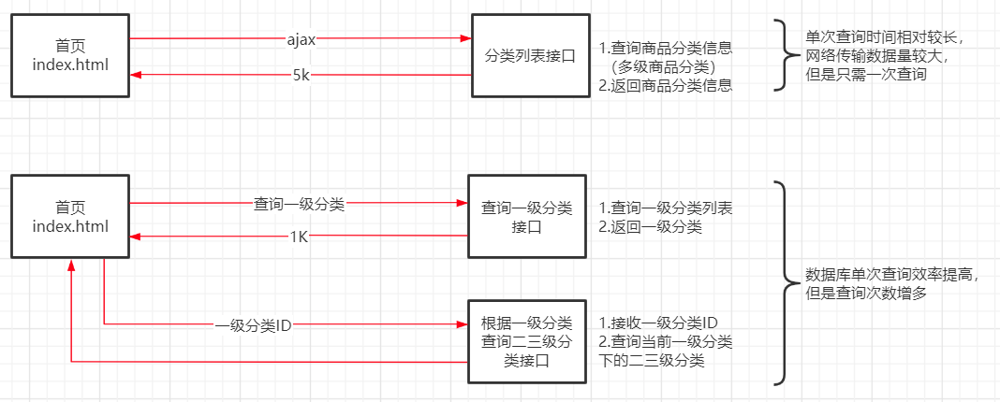

- 方案一：一次性查询三级分类
  - 优点：只需要一次查询，根据一级分类显示二级分类时响应速度较快
  - 缺点：数据库查询效率较低，页面首次加载的速度也相对较慢

- 方案二：先只查询一级分类，用户点击/鼠标移动到一级分类，动态加载二级分类
  - 优点：数据库查询效率提高，页面首次加载速度提高
  - 缺点：需要多次连接数据库

#### 9.2 接口开发

###### 9.2.1 数据库操作实现

- 数据表结构

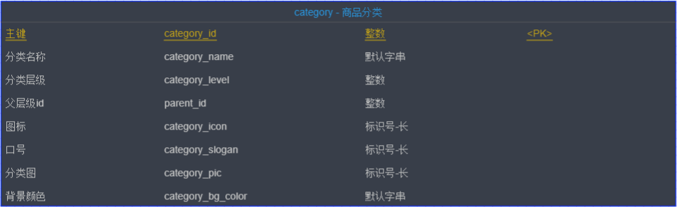

- 添加测试数据

- 编写接口实现所需的SQL

  - 连接查询

  ```sql
  select 
  c1.category_id 'category_id1',
  c1.category_name 'category_name1',
  c1.category_level 'category_level1',
  c1.parent_id 'parent_id1',
  c1.category_icon 'category_icon1',
  c1.category_slogan 'category_slogan1',
  c1.category_pic 'category_pic1',
  c1.category_bg_color 'category_bg_color1',
  c2.category_id 'category_id2',
  c2.category_name 'category_name2',
  c2.category_level 'category_level2',
  c2.parent_id 'parent_id2',
  c3.category_id 'category_id3',
  c3.category_name 'category_name3',
  c3.category_level 'category_level3',
  c3.parent_id 'parent_id3'
  from category c1 
  inner join category c2 
  on c2.parent_id=c1.category_id
  left join category c3
  on c3.parent_id=c2.category_id
  where c1.category_level=1
  ```

  - 子查询

  ```sql
  -- 根据父级分类的id查询类别信息
  select * from category where parent_id=3;
  ```

- 创建用于封装查询的类别信息的CategoryVO

  `在beans子工程的entity包新建一个CategoryVO用于封装查询到类别信息，相对于Category来说，新增了如下属性：`

  ```JAVA
  public class CategoryVO {
      //用于存放当前分类的子分类
      private List<CategoryVO> categories;
  
      public List<CategoryVO> getCategories() {
          return categories;
      }
  }
  ```

- 在CategoryMapper定义操作方法

  ```java
  @Repository
  public interface CategoryMapper extends GeneralDAO<Category> {
  
      //1.连接查询
      public List<CategoryVO> selectAllCategories();
  
      //2.子查询：根据parentId查询子分类
      public List<CategoryVO> selectAllCategories2(int parentId);
  
  }
  ```

- 映射配置

  ```xml
  <?xml version="1.0" encoding="UTF-8"?>
  <!DOCTYPE mapper PUBLIC "-//mybatis.org//DTD Mapper 3.0//EN" "http://mybatis.org/dtd/mybatis-3-mapper.dtd">
  <mapper namespace="com.qfedu.fmmall.dao.CategoryMapper">
    <resultMap id="BaseResultMap" type="com.qfedu.fmmall.entity.Category">
      <id column="category_id" jdbcType="INTEGER" property="categoryId" />
      <result column="category_name" jdbcType="VARCHAR" property="categoryName" />
      <result column="category_level" jdbcType="INTEGER" property="categoryLevel" />
      <result column="parent_id" jdbcType="INTEGER" property="parentId" />
      <result column="category_icon" jdbcType="VARCHAR" property="categoryIcon" />
      <result column="category_slogan" jdbcType="VARCHAR" property="categorySlogan" />
      <result column="category_pic" jdbcType="VARCHAR" property="categoryPic" />
      <result column="category_bg_color" jdbcType="VARCHAR" property="categoryBgColor" />
    </resultMap>
  
  
    <resultMap id="categoryVOMap" type="com.qfedu.fmmall.entity.CategoryVO">
      <id column="category_id1" jdbcType="INTEGER" property="categoryId" />
      <result column="category_name1" jdbcType="VARCHAR" property="categoryName" />
      <result column="category_level1" jdbcType="INTEGER" property="categoryLevel" />
      <result column="parent_id1" jdbcType="INTEGER" property="parentId" />
      <result column="category_icon1" jdbcType="VARCHAR" property="categoryIcon" />
      <result column="category_slogan1" jdbcType="VARCHAR" property="categorySlogan" />
      <result column="category_pic1" jdbcType="VARCHAR" property="categoryPic" />
      <result column="category_bg_color1" jdbcType="VARCHAR" property="categoryBgColor" />
      <collection property="categories" ofType="com.qfedu.fmmall.entity.CategoryVO">
          <id column="category_id2" jdbcType="INTEGER" property="categoryId" />
          <result column="category_name2" jdbcType="VARCHAR" property="categoryName" />
          <result column="category_level2" jdbcType="INTEGER" property="categoryLevel" />
          <result column="parent_id2" jdbcType="INTEGER" property="parentId" />
          <collection property="categories"  ofType="com.qfedu.fmmall.entity.CategoryVO">
              <id column="category_id3" jdbcType="INTEGER" property="categoryId" />
              <result column="category_name3" jdbcType="VARCHAR" property="categoryName" />
              <result column="category_level3" jdbcType="INTEGER" property="categoryLevel" />
              <result column="parent_id3" jdbcType="INTEGER" property="parentId" />
          </collection>
      </collection>
        
    </resultMap>
  
    <select id="selectAllCategories" resultMap="categoryVOMap">
      select
        c1.category_id 'category_id1',
        c1.category_name 'category_name1',
        c1.category_level 'category_level1',
        c1.parent_id 'parent_id1',
        c1.category_icon 'category_icon1',
        c1.category_slogan 'category_slogan1',
        c1.category_pic 'category_pic1',
        c1.category_bg_color 'category_bg_color1',
        c2.category_id 'category_id2',
        c2.category_name 'category_name2',
        c2.category_level 'category_level2',
        c2.parent_id 'parent_id2',
        c3.category_id 'category_id3',
        c3.category_name 'category_name3',
        c3.category_level 'category_level3',
        c3.parent_id 'parent_id3'
      from category c1
             inner join category c2
                        on c2.parent_id=c1.category_id
             left join category c3
                       on c3.parent_id=c2.category_id
      where c1.category_level=1
    </select>
      
      <!---------------------------------------------------------------------------->
  
         <resultMap id="categoryVOMap2" type="com.qfedu.fmmall.entity.CategoryVO">
          <id column="category_id" jdbcType="INTEGER" property="categoryId" />
          <result column="category_name" jdbcType="VARCHAR" property="categoryName" />
          <result column="category_level" jdbcType="INTEGER" property="categoryLevel" />
          <result column="parent_id" jdbcType="INTEGER" property="parentId" />
          <result column="category_icon" jdbcType="VARCHAR" property="categoryIcon" />
          <result column="category_slogan" jdbcType="VARCHAR" property="categorySlogan" />
          <result column="category_pic" jdbcType="VARCHAR" property="categoryPic" />
          <result column="category_bg_color" jdbcType="VARCHAR" property="categoryBgColor" />
          <collection property="categories" column="category_id" select="com.qfedu.fmmall.dao.CategoryMapper.selectAllCategories2"/>
      </resultMap>
  
      <!-- 根据父级分类的id查询子级分类  -->
      <select id="selectAllCategories2" resultMap="categoryVOMap2">
          select
              category_id,
              category_name,
              category_level,
              parent_id,
              category_icon,
              category_slogan,
              category_pic,
              category_bg_color
          from category
          where parent_id=#{parentId}
      </select>
  </mapper>
  ```

###### 9.2.2 业务层实现

- CategoryService接口

  ```java
  public interface CategoryService {
  
      public ResultVO listCategories();
  
  }
  ```

-  CategoryServiceImpl

  ```java
  @Service
  public class CategoryServiceImpl implements CategoryService {
  
      @Autowired
      private CategoryMapper categoryMapper;
  
      public ResultVO listCategories() {
          List<CategoryVO> categoryVOS = categoryMapper.selectAllCategories();
          ResultVO resultVO = new ResultVO(ResStatus.OK, "success", categoryVOS);
          return resultVO;
      }
  
  }
  ```

###### 9.2.3 控制层实现

- IndexController

  ```java
  @Autowired
  private CategoryService categoryService;
  
  @GetMapping("/category-list")
  @ApiOperation("商品分类查询接口")
  public ResultVO listCatetory(){
      return categoryService.listCategories();
  }
  ```

#### 9.3 前端功能实现


## 十、首页-商品推荐

#### 10.1 流程分析

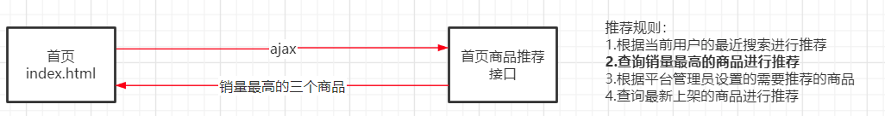

#### 10.2 接口开发

###### 10.2.1 数据库实现

> 商品推荐算法：推荐最新上架的商品
>
> 说明：商品推荐算法是根据多个维度进行权重计算，计算出一个匹配值

- 数据表分析及数据准备

- sql

  ```sql
  -- 商品推荐：查询最新上架的商品
  select * from product order by create_time desc limit 0,3;
   
  -- 子查询：根据商品id查询商品图片
  select * from product_img where item_id=2;
  ```

- 在beans子工程entity包创建ProductVO,相比较Product新增了List<ProductImg> imgs用于存储商品的图片

  ```java
  public class ProductVO{
      private List<ProductImg> imgs;
  
      public List<ProductImg> getImgs() {
          return imgs;
      }
  
      public void setImgs(List<ProductImg> imgs) {
          this.imgs = imgs;
      }
  }
  ```

- Mapper接口定义操作方法：

  - ProductMapper

  ```java
  public interface ProductMapper extends GeneralDAO<Product> {
  
      public List<ProductVO> selectRecommendProducts();
  
  }
  ```

  - ProductImgMapper

  ```java
  public interface ProductImgMapper extends GeneralDAO<ProductImg> {
      //根据商品id查询当前商品的图片信息
      public List<ProductImg> selectProductImgByProductId(int productId);
      
  }
  ```

- 配置映射文件

  - ProductMapper.xml

  ```xml
  <resultMap id="ProductVOMap" type="com.qfedu.fmmall.entity.ProductVO">
      <id column="product_id" jdbcType="VARCHAR" property="productId" />
      <result column="product_name" jdbcType="VARCHAR" property="productName" />
      <result column="category_id" jdbcType="INTEGER" property="categoryId" />
      <result column="root_category_id" jdbcType="INTEGER" property="rootCategoryId" />
      <result column="sold_num" jdbcType="INTEGER" property="soldNum" />
      <result column="product_status" jdbcType="INTEGER" property="productStatus" />
      <result column="create_time" jdbcType="TIMESTAMP" property="createTime" />
      <result column="update_time" jdbcType="TIMESTAMP" property="updateTime" />
      <result column="content" jdbcType="LONGVARCHAR" property="content" />
      <collection property="imgs" select="com.qfedu.fmmall.dao.ProductImgMapper.selectProductImgByProductId" column="product_id"/>
  </resultMap>
  
  <select id="selectRecommendProducts" resultMap="ProductVOMap">
      select
      product_id,
      product_name,
      category_id,
      root_category_id,
      sold_num,
      product_status,
      content,
      create_time,
      update_time
      from product
      order by create_time desc
      limit 0,3
  </select>
  ```

  - ProductImgMapper.xml

  ```xml
  <?xml version="1.0" encoding="UTF-8"?>
  <!DOCTYPE mapper PUBLIC "-//mybatis.org//DTD Mapper 3.0//EN" "http://mybatis.org/dtd/mybatis-3-mapper.dtd">
  <mapper namespace="com.qfedu.fmmall.dao.ProductImgMapper">
  
    <resultMap id="BaseResultMap" type="com.qfedu.fmmall.entity.ProductImg">
      <id column="id" jdbcType="VARCHAR" property="id" />
      <result column="item_id" jdbcType="VARCHAR" property="itemId" />
      <result column="url" jdbcType="VARCHAR" property="url" />
      <result column="sort" jdbcType="INTEGER" property="sort" />
      <result column="is_main" jdbcType="INTEGER" property="isMain" />
      <result column="created_time" jdbcType="TIMESTAMP" property="createdTime" />
      <result column="updated_time" jdbcType="TIMESTAMP" property="updatedTime" />
    </resultMap>
  
  
    <select id="selectProductImgByProductId" resultMap="BaseResultMap">
      select
        id,
        item_id,
        url,
        sort,
        is_main,
        created_time,
        updated_time
      from product_img
      where item_id=#{productId}
    </select>
  </mapper>
  ```

###### 10.2.2 业务层实现

- ProductService接口

  ```java
  public interface ProductService {
  
      public ResultVO listRecommendProducts();
  
  }
  
  ```

- ProductServiceImpl实现类

  ```java
  @Service
  public class ProductServiceImpl implements ProductService {
  
      @Autowired
      private ProductMapper productMapper;
  
      public ResultVO listRecommendProducts() {
          List<ProductVO> productVOS = productMapper.selectRecommendProducts();
          ResultVO resultVO = new ResultVO(ResStatus.OK, "success", productVOS);
          return resultVO;
      }
  }
  ```

###### 10.2.3 控制层实现

- IndexController

  ```java
  @Autowired
  private ProductService productService;
  
  
  @GetMapping("/list-recommends")
  @ApiOperation("查询推荐商品接口")
  public ResultVO listRecommendProducts() {
      return productService.listRecommendProducts();
  }
  ```

#### 10.3 前端实现


## 十一、首页-分类商品推荐

>按照商品的分类（一级分类）推荐销量最高的6个商品

#### 11.1 流程分析

> 加载分类商品推荐有两种实现方案：
>
> 方案一：当加载首页面时不加载分类的推荐商品，监听进度条滚动事件，当进度条触底（滚动指定的距离）就触发分类推荐商品的加载，每次只加载一个分类的商品。

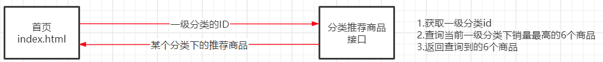

> 方案二：一次性加载所有分类的推荐商品，整体进行初始化。

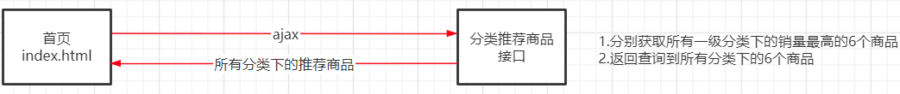

#### 11.2 接口实现

###### 11.2.1 数据库实现

- 数据准备

  ```sql
  -- 添加商品
  -- 添加十个分类下的商品：
  insert into product(product_id,product_name,category_id,root_category_id,sold_num,product_status,content,create_time,updated_time)
  values('5','商品5',10,1,122,1,'商品说明','2021-04-26 11:11:11','2021-04-26 11:11:11');
  insert into product(product_id,product_name,category_id,root_category_id,sold_num,product_status,content,create_time,updated_time)
  values('6','商品6',10,1,123,1,'商品说明','2021-04-26 11:11:11','2021-04-26 11:11:11');
  insert into product(product_id,product_name,category_id,root_category_id,sold_num,product_status,content,create_time,updated_time)
  values('7','商品7',10,1,124,1,'商品说明','2021-04-26 11:11:11','2021-04-26 11:11:11');
  insert into product(product_id,product_name,category_id,root_category_id,sold_num,product_status,content,create_time,updated_time)
  values('8','商品8',10,1,125,1,'商品说明','2021-04-26 11:11:11','2021-04-26 11:11:11');
  insert into product(product_id,product_name,category_id,root_category_id,sold_num,product_status,content,create_time,updated_time)
  values('9','商品9',10,1,126,1,'商品说明','2021-04-26 11:11:11','2021-04-26 11:11:11');
  insert into product(product_id,product_name,category_id,root_category_id,sold_num,product_status,content,create_time,updated_time)
  values('10','商品10',10,1,127,1,'商品说明','2021-04-26 11:11:11','2021-04-26 11:11:11');
  insert into product(product_id,product_name,category_id,root_category_id,sold_num,product_status,content,create_time,updated_time)
  values('11','商品11',10,1,128,1,'商品说明','2021-04-26 11:11:11','2021-04-26 11:11:11');
  
  
  insert into product(product_id,product_name,category_id,root_category_id,sold_num,product_status,content,create_time,updated_time)
  values('12','商品12',46,2,122,1,'商品说明','2021-04-26 11:11:11','2021-04-26 11:11:11');
  insert into product(product_id,product_name,category_id,root_category_id,sold_num,product_status,content,create_time,updated_time)
  values('13','商品13',46,2,123,1,'商品说明','2021-04-26 11:11:11','2021-04-26 11:11:11');
  insert into product(product_id,product_name,category_id,root_category_id,sold_num,product_status,content,create_time,updated_time)
  values('14','商品14',46,2,124,1,'商品说明','2021-04-26 11:11:11','2021-04-26 11:11:11');
  insert into product(product_id,product_name,category_id,root_category_id,sold_num,product_status,content,create_time,updated_time)
  values('15','商品15',46,2,125,1,'商品说明','2021-04-26 11:11:11','2021-04-26 11:11:11');
  insert into product(product_id,product_name,category_id,root_category_id,sold_num,product_status,content,create_time,updated_time)
  values('16','商品16',46,2,126,1,'商品说明','2021-04-26 11:11:11','2021-04-26 11:11:11');
  insert into product(product_id,product_name,category_id,root_category_id,sold_num,product_status,content,create_time,updated_time)
  values('17','商品17',46,2,127,1,'商品说明','2021-04-26 11:11:11','2021-04-26 11:11:11');
  insert into product(product_id,product_name,category_id,root_category_id,sold_num,product_status,content,create_time,updated_time)
  values('18','商品18',46,2,128,1,'商品说明','2021-04-26 11:11:11','2021-04-26 11:11:11');
   
   
  -- 添加商品图片
  insert into product_img(id,item_id,url,sort,is_main,created_time,updated_time)
  values('9','5','wwxb_1.png',1,1,'2021-04-26 11:11:11','2021-04-26 11:11:11');
  
  insert into product_img(id,item_id,url,sort,is_main,created_time,updated_time)
  values('10','6','wwxb_1.png',1,1,'2021-04-26 11:11:11','2021-04-26 11:11:11');
  
  insert into product_img(id,item_id,url,sort,is_main,created_time,updated_time)
  values('11','7','wwxb_1.png',1,1,'2021-04-26 11:11:11','2021-04-26 11:11:11');
  
  insert into product_img(id,item_id,url,sort,is_main,created_time,updated_time)
  values('12','8','wwxb_1.png',1,1,'2021-04-26 11:11:11','2021-04-26 11:11:11');
  
  insert into product_img(id,item_id,url,sort,is_main,created_time,updated_time)
  values('13','9','wwxb_1.png',1,1,'2021-04-26 11:11:11','2021-04-26 11:11:11');
  
  insert into product_img(id,item_id,url,sort,is_main,created_time,updated_time)
  values('14','10','wwxb_1.png',1,1,'2021-04-26 11:11:11','2021-04-26 11:11:11');
  
  insert into product_img(id,item_id,url,sort,is_main,created_time,updated_time)
  values('15','11','wwxb_1.png',1,1,'2021-04-26 11:11:11','2021-04-26 11:11:11');
  
  insert into product_img(id,item_id,url,sort,is_main,created_time,updated_time)
  values('16','12','wwxb_1.png',1,1,'2021-04-26 11:11:11','2021-04-26 11:11:11');
  
  insert into product_img(id,item_id,url,sort,is_main,created_time,updated_time)
  values('17','13','wwxb_1.png',1,1,'2021-04-26 11:11:11','2021-04-26 11:11:11');
  
  insert into product_img(id,item_id,url,sort,is_main,created_time,updated_time)
  values('18','14','wwxb_1.png',1,1,'2021-04-26 11:11:11','2021-04-26 11:11:11');
  
  insert into product_img(id,item_id,url,sort,is_main,created_time,updated_time)
  values('19','15','wwxb_1.png',1,1,'2021-04-26 11:11:11','2021-04-26 11:11:11');
  
  insert into product_img(id,item_id,url,sort,is_main,created_time,updated_time)
  values('20','16','wwxb_1.png',1,1,'2021-04-26 11:11:11','2021-04-26 11:11:11');
  
  insert into product_img(id,item_id,url,sort,is_main,created_time,updated_time)
  values('21','17','wwxb_1.png',1,1,'2021-04-26 11:11:11','2021-04-26 11:11:11');
  
  insert into product_img(id,item_id,url,sort,is_main,created_time,updated_time)
  values('22','18','wwxb_1.png',1,1,'2021-04-26 11:11:11','2021-04-26 11:11:11');
  ```

- 查询SQL

  ```sql
  -- 查询所有的一级分类
  select * from category where category_level=1;
  -- 查询每个分类下销量前6的商品
  select * from product where root_category_id=2 order by sold_num desc limit 0,6;
  -- 查询每个商品的图片
  select * from product_img where item_id = 1;
  ```

- 实体类：

  ```java
  @Data
  @NoArgsConstructor
  @AllArgsConstructor
  @ToString
  public class CategoryVO {
  
      private Integer categoryId;
      private String categoryName;
      private Integer categoryLevel;
      private Integer parentId;
      private String categoryIcon;
      private String categorySlogan;
      private String categoryPic;
      private String categoryBgColor;
      //实现首页的类别显示
      private List<CategoryVO> categories;
      //实现首页分类商品推荐
      private List<ProductVO> products;
  
  }
  ```

- 在Mapper接口中定义查询方法

  | CategoryMapper                           |
  | ---------------------------------------- |
  | 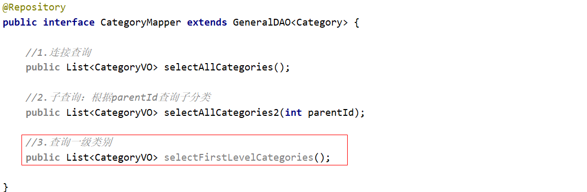 |

  | ProductMapper                            |
  | ---------------------------------------- |
  | 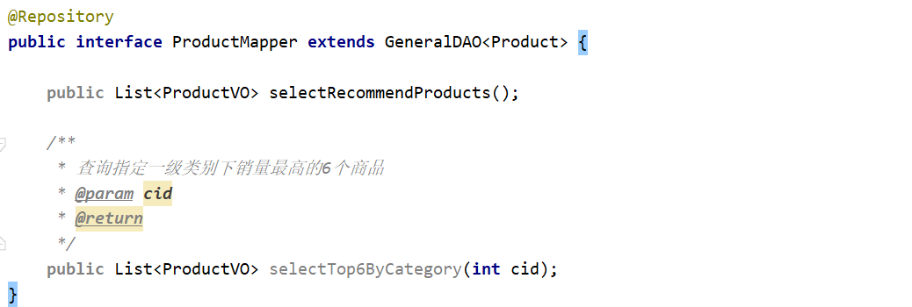 |

- 映射配置

  | ProductMapper.xml                        |
  | ---------------------------------------- |
  | 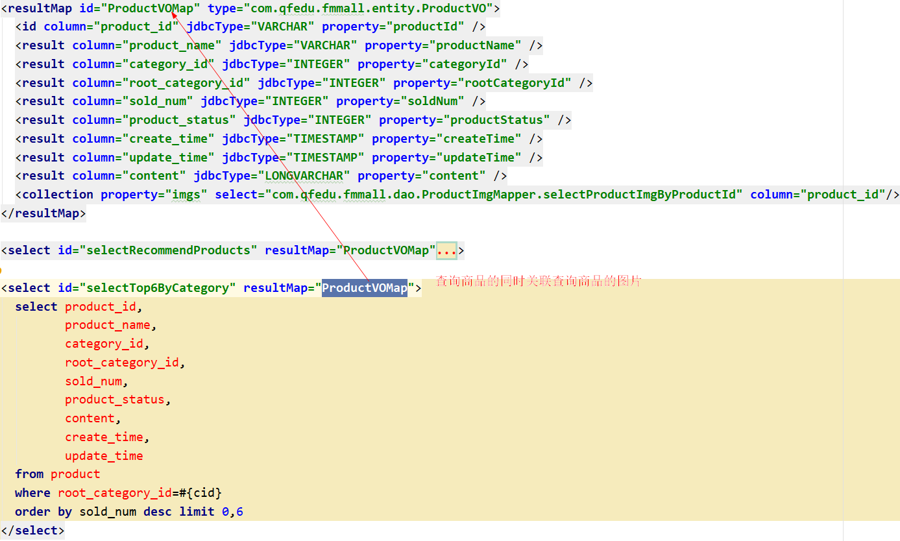 |

  | CategoryMapper.xml                       |
  | ---------------------------------------- |
  | 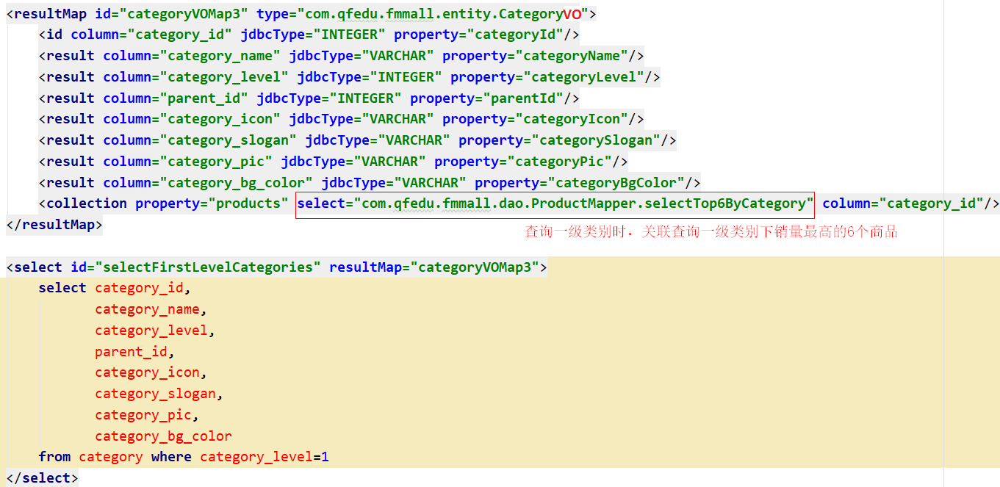 |

###### 11.2.2 业务层实现

###### 11.2.3 控制层实现

#### 11.3 前端实现


## 十二、商品详情展示—显示商品基本信息

> 点击首页推荐的商品、轮播图商品广告、商品列表页面点击商品，就会进入到商品的详情页面

#### 12.1 流程分析

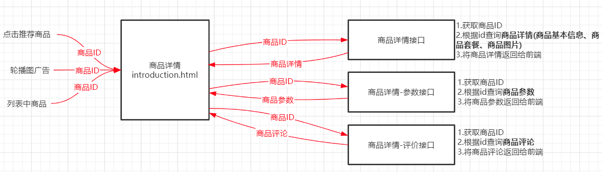

#### 12.2 商品基础信息-接口实现


> 商品基本信息、商品套餐、商品图片

- SQL

  ```sql
  -- 根据id查询商品基本信息
  select * from product where product_id=3;
  
  -- 根据商品id查询当前商品的图片（√）
  select * from product_img where item_id=3;
  
  -- 根据商品id查询当前商品的套餐
  select * from product_sku where product_id=3;
  ```

- 因为上述的三个查询都是单表查询，可以通过tkmapper完成，无需在Mapper接口定义新的方法

- 业务层实现

  | ProductService接口                       |
  | ---------------------------------------- |
  | 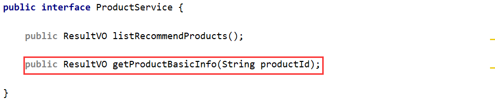 |

  | ProductServiceImpl类实现                 |
  | ---------------------------------------- |
  | 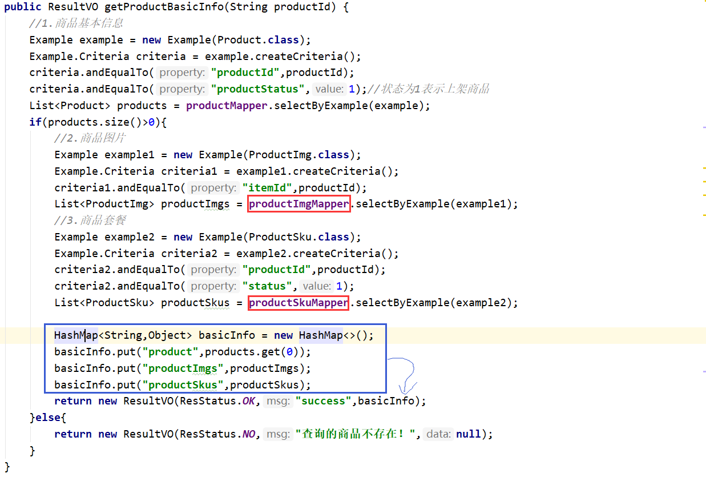 |

- 控制层实现

  | ProductController类                      |
  | ---------------------------------------- |
  | 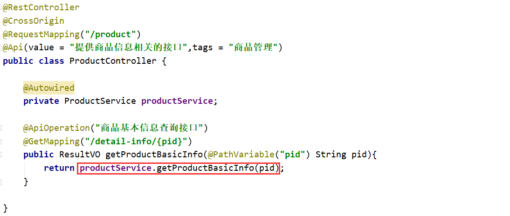 |

#### 12.3 商品基础信息-前端显示

## 十三、商品详情展示—显示商品参数信息

#### 13.1 接口实现

> 根据商品id查询商品参数信息

- 数据库操作直接只用tkMapper的默认方法实现

- 业务层实现

  |                                          |
  | ---------------------------------------- |
  | 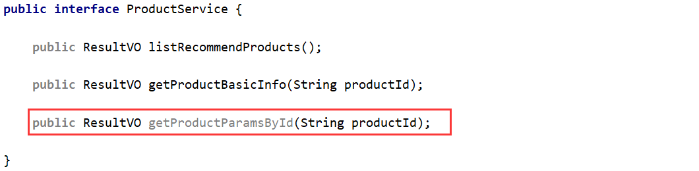 |

- 控制层实现

#### 13.2 前端显示商品参数

#### 13.3 前端显示商品细节

###### 前端页面间URL传值

- utils.js

  ```javascript
  function getUrlParam(key){
  	var url = decodeURI( window.location.toString() );
  	var arr = url.split("?");
  	if(arr.length>1){
  		var params = arr[1].split("&");
  		for(var i=0; i<params.length; i++){
  			var param = params[i];  //"pid=101"
  			if(param.split("=")[0] == key ){
  				return param.split("=")[1];
  			}
  		}
  	}
  	return null;
  }
  ```

- a.html

  ```html
  <!DOCTYPE html>
  <html>
  	<head>
  		<meta charset="UTF-8">
  		<title></title>
  	</head>
  	<body>
  		
  		<a href="b.html?pid=101&pname=咪咪虾条">跳转到B页面</a>
  		
  	</body>
  </html>
  ```

- b.html

  ```html
  <!DOCTYPE html>
  <html>
  	<head>
  		<meta charset="UTF-8">
  		<title></title>
  	</head>
  	<body>
  		This is Page B...
  		<hr/>
  		
  		<script type="text/javascript" src="js/utils.js" ></script>
  		<script type="text/javascript">
  			var pid = getUrlParam("pid");
  			
  		</script>
  		
  	</body>
  </html>
  ```


## 十四、商品详情展示—显示商品评论信息

#### 14.1 接口实现

###### 14.1.1 数据库实现

- 数据表分析及数据准备
- SQL

```sql
-- 根据ID查询商品的评价信息，关联查询评价用户的信息
select u.username,u.nickname,u.user_img,c.* 
from product_comments c
INNER JOIN users u
ON u.user_id = c.user_id
WHERE c.product_id =3;
```

- 实体类封装`ProductCommentsVO`

```java
@Data
@AllArgsConstructor
@NoArgsConstructor
public class ProductCommentsVO {

    private String commId;
    private String productId;
    private String productName;
    private String orderItemId;
    private Integer isAnonymous;
    private Integer commType;
    private Integer commLevel;
    private String commContent;
    private String commImgs;
    private Date sepcName;
    private Integer replyStatus;
    private String replyContent;
    private Date replyTime;
    private Integer isShow;
    //封装评论对应的用户数据
    private String userId;
    private String username;
    private String nickname;
    private String userImg;
}
```

- 在Mapper接口定义查询方法

```java
@Repository
public interface ProductCommentsMapper extends GeneralDAO<ProductComments> {
    
    public List<ProductCommentsVO> selectCommontsByProductId(String productId);
    
}
```

- 映射配置：

```xml

```

###### 14.1.2 业务层实现

- 创建`ProductCommontsService`接口定义方法

```java
public interface ProductCommontsService {

    public ResultVO listCommontsByProductId(String productId);

}
```

- 创建实现类`ProductCommontsServiceImpl`实现查询操作

```java
@Service
public class ProductCommontsServiceImpl implements ProductCommontsService {
    
    @Autowired
    private ProductCommentsMapper productCommentsMapper;
    
    @Override
    public ResultVO listCommontsByProductId(String productId) {
        List<ProductCommentsVO> productCommentsVOS = productCommentsMapper.selectCommontsByProductId(productId);
        ResultVO resultVO = new ResultVO(ResStatus.OK, "success", productCommentsVOS);
        return resultVO;
    }
}
```

###### 14.1.3 控制层实现

- ProductController

```java
@ApiOperation("商品评论信息查询接口")
@GetMapping("/detail-commonts/{pid}")
public ResultVO getProductCommonts(@PathVariable("pid") String pid){
    return productCommontsService.listCommontsByProductId(pid);
}
```


#### 14.2 前端评论内容显示


## 十五、商品详情展示—商品评论分页及统计信息

#### 15.1 流程分析

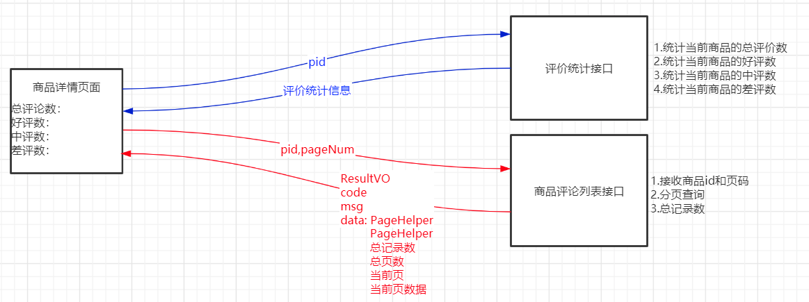


#### 15.2 接口开发

###### 15.2.1 改造商品评论列表接口

> 分页查询

- 定义PageHelper

  ```java
  @Data
  @NoArgsConstructor
  @AllArgsConstructor
  public class PageHelper<T> {
  
      //总记录数
      private int count;
  
      //总页数
      private int pageCount;
  
      //分页数据
      private List<T> list;
  
  }
  ```

- 改造数据库操作

  | ProductCommentsMapper 接口               |
  | ---------------------------------------- |
  | 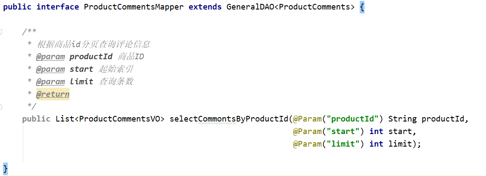 |

  | ProductCommentsMapper.xml映射配置        |
  | ---------------------------------------- |
  | 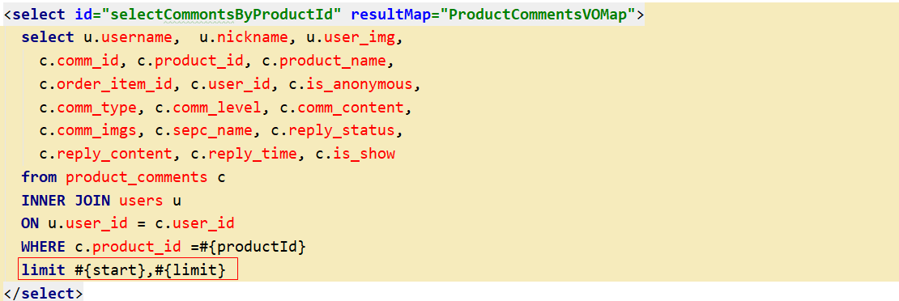 |

- 改造业务逻辑层

  | ProductCommontsService接口               |
  | ---------------------------------------- |
  | 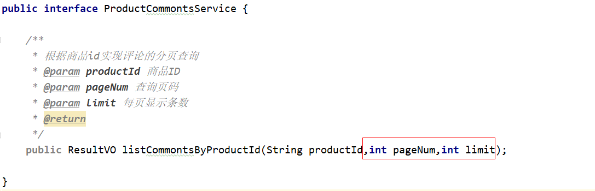 |

  | ProductCommontsServiceImpl               |
  | ---------------------------------------- |
  | 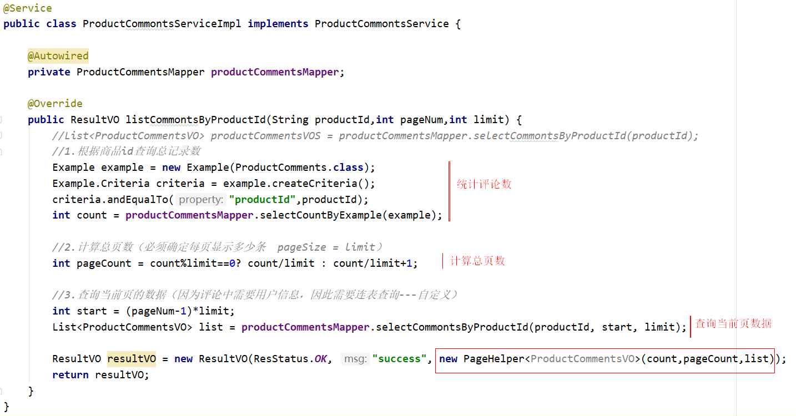 |

- 改造控制层

  | ProductController                        |
  | ---------------------------------------- |
  | 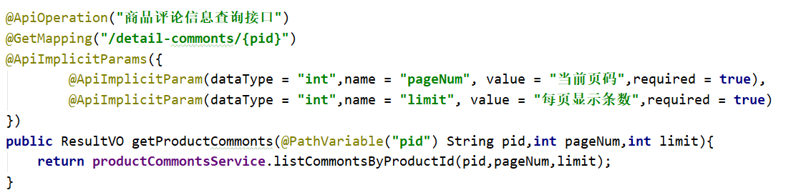 |

###### 15.2.2 评价统计接口实现

- 数据库实现
  - 统计当前商品的总记录数
  - 统计当前商品的好评/中评/差评

- 业务层实现: `ProductCommontsServiceImpl`

  ```java
  @Override
  public ResultVO getCommentsCountByProductId(String productId) {
      //1.查询当前商品评价的总数
      Example example = new Example(ProductComments.class);
      Example.Criteria criteria = example.createCriteria();
      criteria.andEqualTo("productId",productId);
      int total = productCommentsMapper.selectCountByExample(example);
  
      //2.查询好评评价数
      criteria.andEqualTo("commType",1);
      int goodTotal = productCommentsMapper.selectCountByExample(example);
  
      //3.查询好评评价数
      Example example1 = new Example(ProductComments.class);
      Example.Criteria criteria1 =  example1.createCriteria();
      criteria1.andEqualTo("productId",productId);
      criteria1.andEqualTo("commType",0);
      int midTotal = productCommentsMapper.selectCountByExample(example1);
  
      //4.查询好评评价数
      Example example2 = new Example(ProductComments.class);
      Example.Criteria criteria2 =  example2.createCriteria();
      criteria2.andEqualTo("productId",productId);
      criteria2.andEqualTo("commType",-1);
      int badTotal = productCommentsMapper.selectCountByExample(example2);
  
      //5.计算好评率
      double percent = (Double.parseDouble(goodTotal+"") / Double.parseDouble(total+"") )*100;
      String percentValue = (percent+"").substring(0,(percent+"").lastIndexOf(".")+3);
  
      HashMap<String,Object> map = new HashMap<>();
      map.put("total",total);
      map.put("goodTotal",goodTotal);
      map.put("midTotal",midTotal);
      map.put("badTotal",badTotal);
      map.put("percent",percentValue);
  
      ResultVO success = new ResultVO(ResStatus.OK, "success", map);
      return success;
  }
  ```

#### 15.3 前端实现

###### 15.3.1 商品评论的分页

- 引用elementUI分页组件

  ```html
  <!-- 引入样式 -->
  <link rel="stylesheet" href="https://unpkg.com/element-ui/lib/theme-chalk/index.css">
  <!-- vue的引入必须在elementUI组件库引入之前 -->
  <script type="text/javascript" src="js/vue.js"></script>
  <!-- 引入组件库 -->
  <script src="https://unpkg.com/element-ui/lib/index.js"></script>
  ```

- 引用分页组件

  ```html
  <!--分页 -->
  <el-pagination background layout="prev, pager, next" 
                 :current-page="pageNum"
                 :page-size="limit" 
                 :total="count"
  				@current-change="pager"> </el-pagination>
  ```

- 监听分页组件的`页码改变`事件（点击上一页、下一页、页码都会导致`页码改变`）

  `分页组件的事件函数默认传递当前页码参数`

  ```javascript
  pager:function(currentPage){
      this.pageNum = currentPage;
      //请求下一页数据
      var url3 = baseUrl+"product/detail-commonts/"+this.productId;
      axios.get(url3,{
          params:{
              pageNum:this.pageNum,
              limit:this.limit
          }
      }).then((res)=>{
          //获取到评论分页数据
          var pageHelper = res.data.data;
          //当前页的评论列表
          this.productCommonts = pageHelper.list;
          //总页数
          this.pageCount = pageHelper.pageCount;
          //总记录数
          this.count = pageHelper.count;
      });
  }
  ```

###### 15.3.2 商品评价统计


## 十六、购物车—添加购物车（登陆状态）

#### 16.1 流程分析

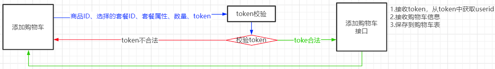


#### 16.2 接口实现

###### 16.2.1 修改购物车数据表结构

| shopping_cart                            |
| ---------------------------------------- |
| 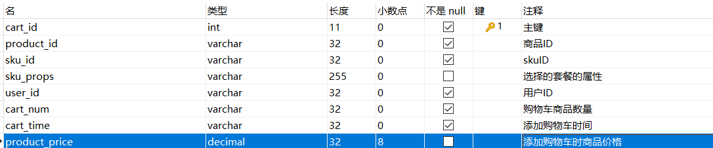 |

- 数据表修改完成之后，对此表重新进行逆向工程

###### 16.2.2 数据库实现

- 单表添加操作，可以直接使用tkMapper完成

###### 16.2.3 业务层实现

- `ShoppingCartService`接口

  ```java
  public interface ShoppingCartService {
  
      public ResultVO addShoppingCart(ShoppingCart cart);
  
  }
  ```

- 实现类

#### 16.3 前端实现

###### 16.3.1  记录选择的套餐属性

- 在vue的data中定义 `chooseSkuProps`

  |                                          |
  | ---------------------------------------- |
  | 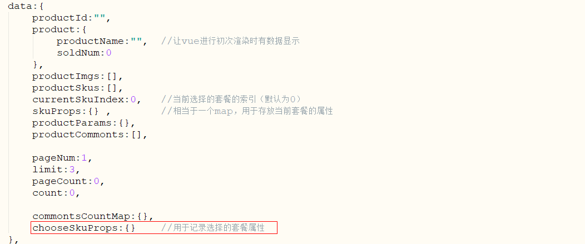 |

- 为sku的属性添加点击事件

  |                                          |
  | ---------------------------------------- |
  | 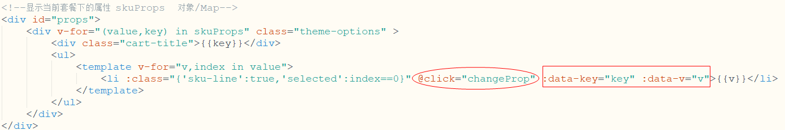 |

- 在methods中定义事件函数`changeProp`

  |                                          |
  | ---------------------------------------- |
  | 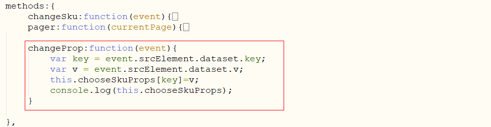 |

- 添加套餐切换的监听事件：

  |                                          |
  | ---------------------------------------- |
  | 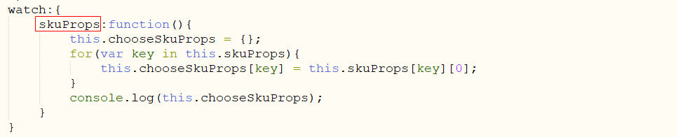 |

###### 16.3.2 套餐属性选中效果

- 在套餐属性标签上添加name属性

  |                                          |
  | ---------------------------------------- |
  | 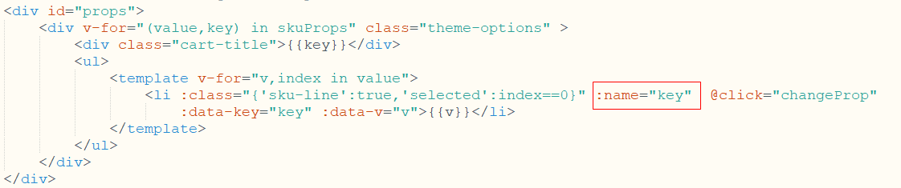 |

- 在属性的点击事件函数实现选中效果

  |                                          |
  | ---------------------------------------- |
  | 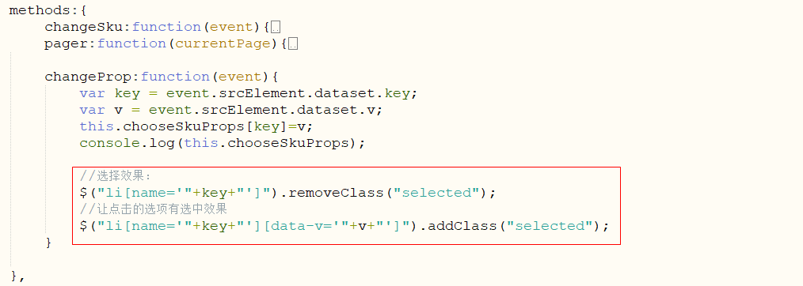 |

###### 16.3.3 修改商品数量

- 在vue的data中定义`num`存储商品数量（默认值为1）

- 为+，-添加点击事件监听

  |                                          |
  | ---------------------------------------- |
  | 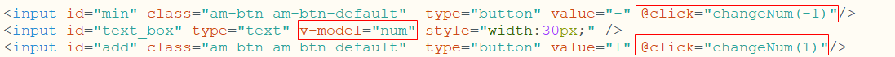 |

- 定义点击事件函数

  |                                          |
  | ---------------------------------------- |
  | 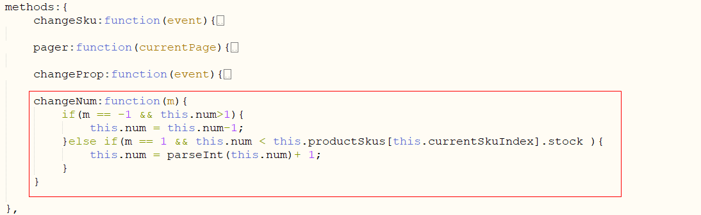 |

###### 16.3.4 提交购物车

|                                          |
| ---------------------------------------- |
| 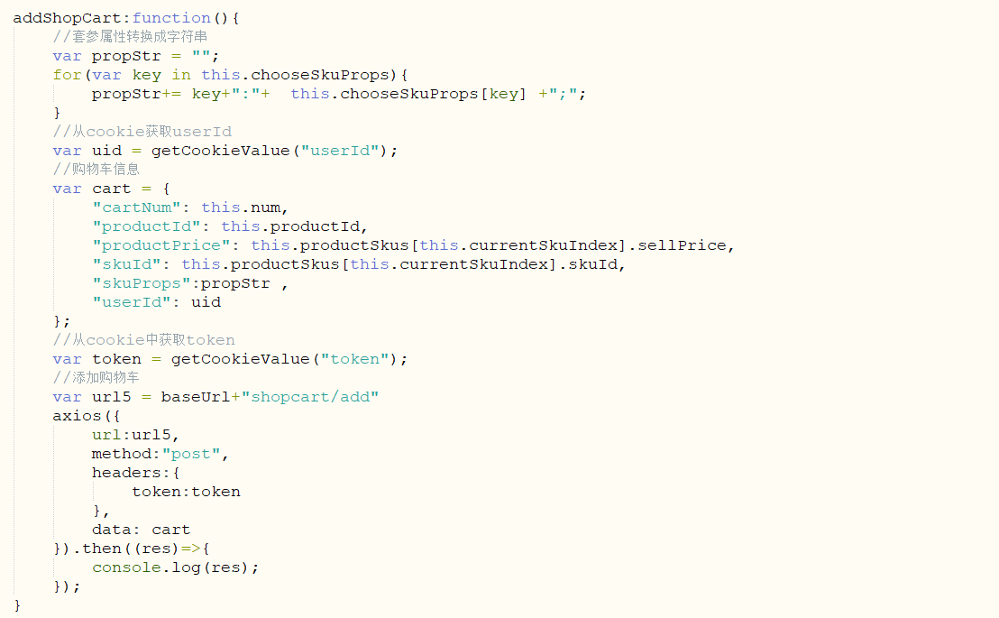 |

## 十七、购物车—添加购物车（未登录状态）

#### 17.1 流程分析

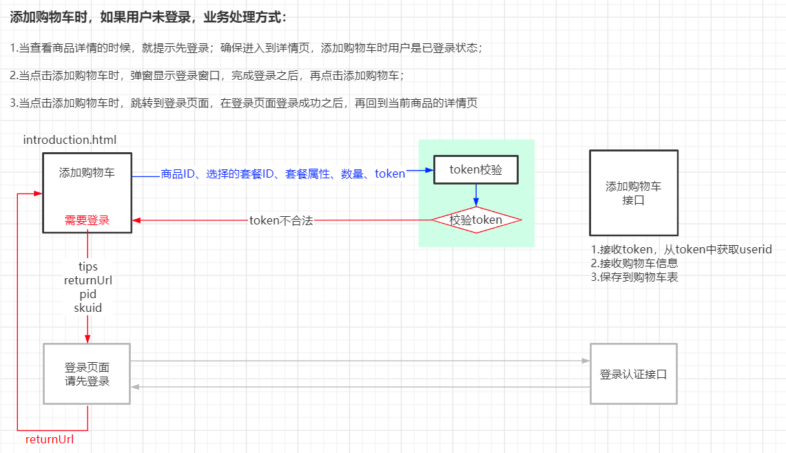

#### 17.2 功能实现

###### 17.2.1 定义新的状态码

| ResStatus                                |
| ---------------------------------------- |
| 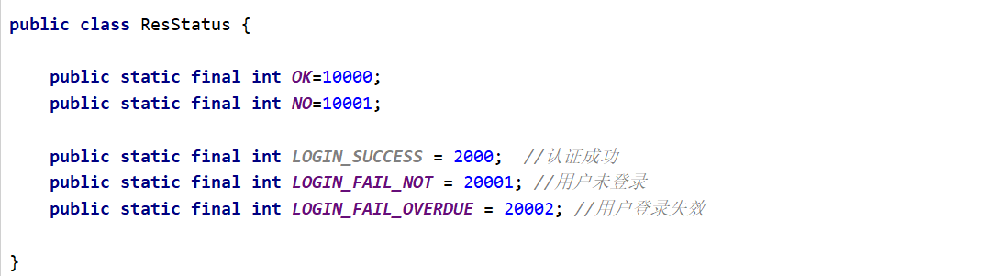 |

| 登录认证拦截器                           |
| ---------------------------------------- |
| 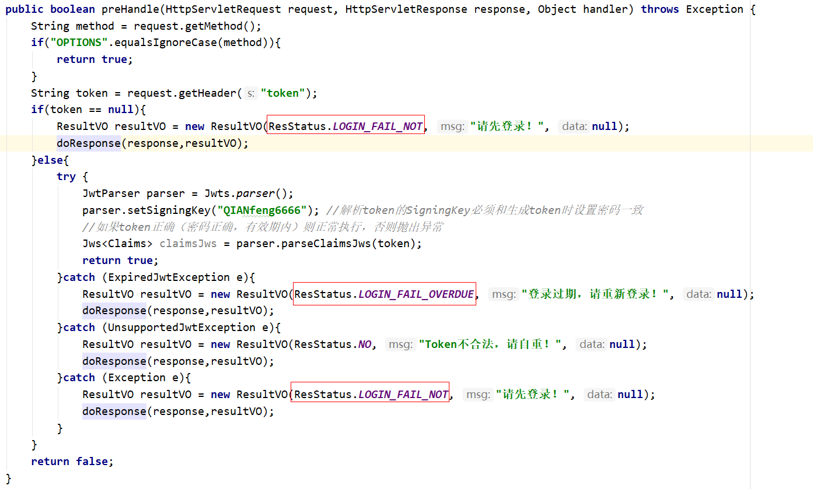 |

###### 17.2.2 在详情页面判断如果用户未登录，则跳转到登录页面

| introduction.html                        |
| ---------------------------------------- |
| 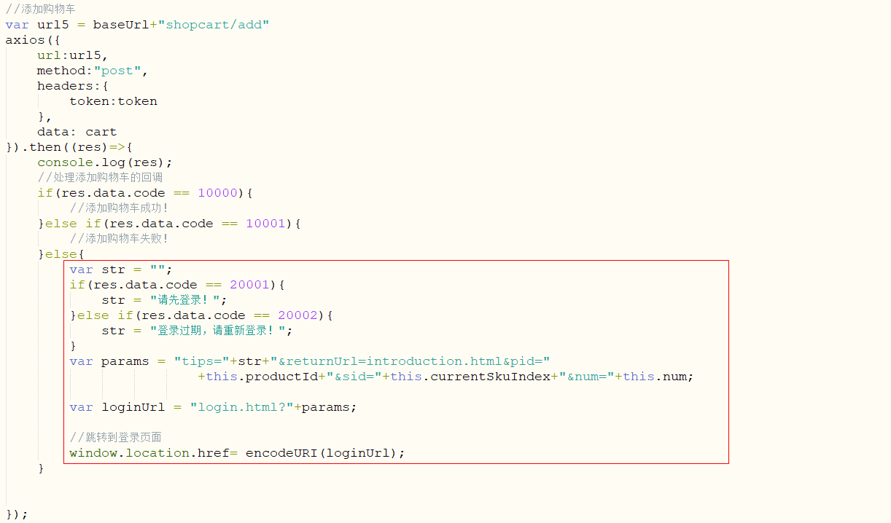 |

###### 17.2.3 登录页面接收回跳信息

| login.html                               |
| ---------------------------------------- |
| 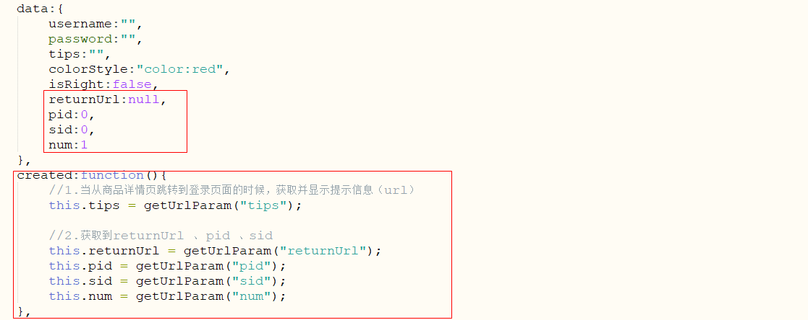 |
| 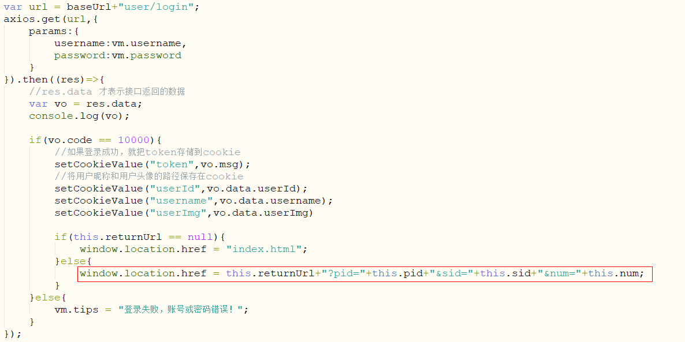 |

###### 17.2.4 回到详情页时接收参数

| introduction.html                        |
| ---------------------------------------- |
| 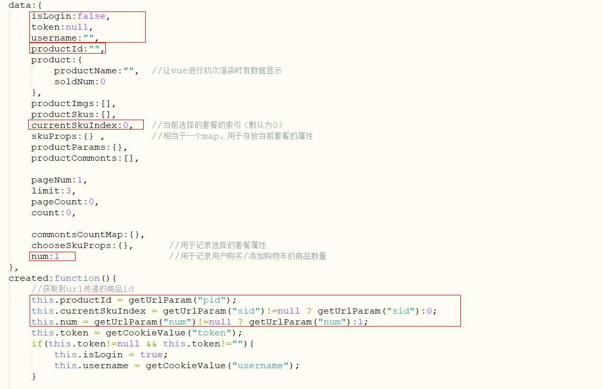 |

###### 17.2.5 使用layui添加购物车成功/失败进行提示

- 引入layui  layui.com

  ```html
  <!-- 引入 layui.css -->
  <link rel="stylesheet" href="//unpkg.com/layui@2.6.5/dist/css/layui.css">
   
  <!-- 引入 layui.js -->
  <script src="//unpkg.com/layui@2.6.5/dist/layui.js">
  ```

- 声明弹窗组件

  |                                          |
  | ---------------------------------------- |
  | 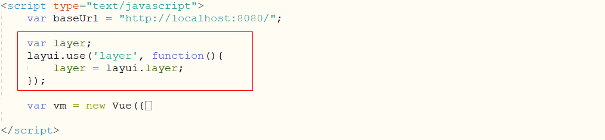 |

- 当添加购物车成功或者失败的时候，进行提示：

  |                                          |
  | ---------------------------------------- |
  | 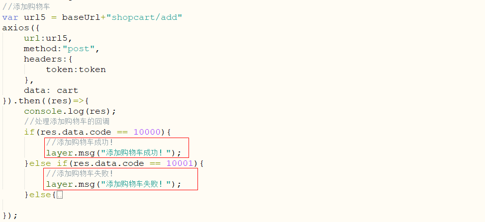 |

## 十八、购物车—购物车列表

#### 18.1 流程分析

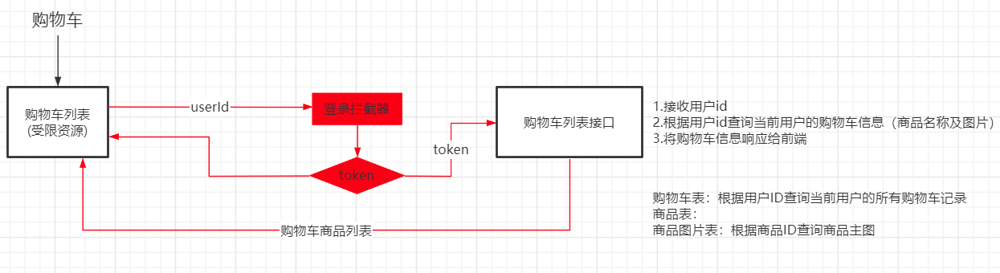

#### 18.2 接口实现

###### 18.2.1 数据库实现

- SQL

  ```SQL
  -- 根据用户ID查询当前用户的购物车信息
  select c.*, p.product_name,i.url
  from shopping_cart c  
  INNER JOIN product p 
  INNER JOIN product_img i
  ON c.product_id = p.product_id and i.item_id=p.product_id
  where user_id=6 and i.is_main=1;
  ```

- 实体类

  |                                          |
  | ---------------------------------------- |
  | 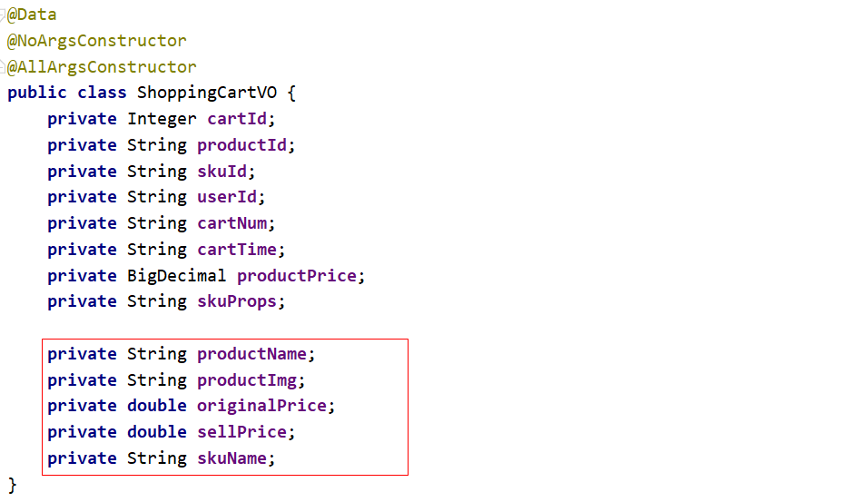 |

- 在Mapper接口定义查询方法

  ```java
  @Repository
  public interface ShoppingCartMapper extends GeneralDAO<ShoppingCart> {
  
      public List<ShoppingCartVO> selectShopcartByUserId(int userId);
  
  }
  ```

- 映射配置

  |                                          |
  | ---------------------------------------- |
  | 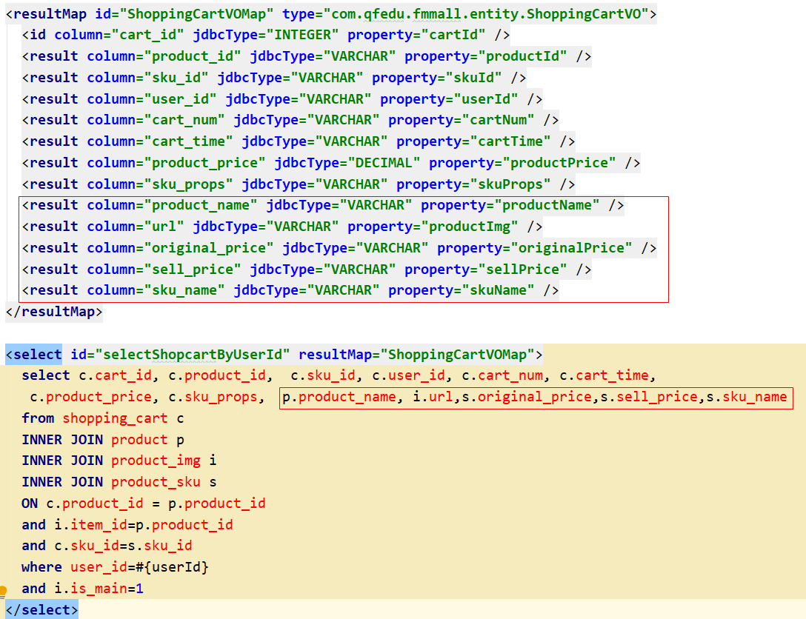 |

###### 18.2.2 业务层实现

- Service接口

  |                                          |
  | ---------------------------------------- |
  | 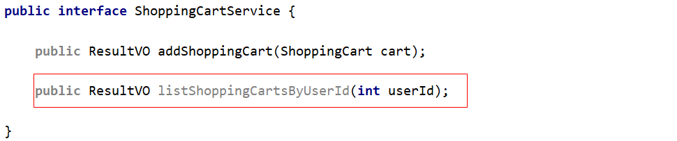 |

- Service实现类

  |                                          |
  | ---------------------------------------- |
  | 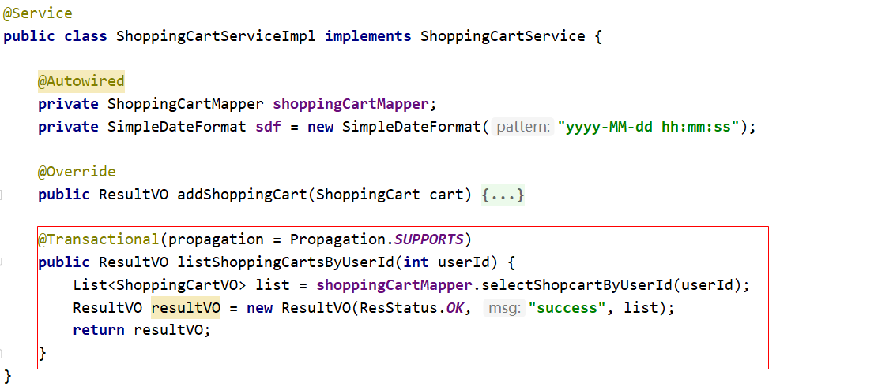 |

###### 18.2.3 控制层实现

#### 18.3 前端实现

###### 18.3.1 显示购物车列表

###### 18.3.2 显示购物车中商品价格


## 十九、购物车-修改购物车数量

#### 19.1 流程分析


#### 19.2 接口实现

- 在Mapper接口定义修改方法

  ```java
  @Repository
  public interface ShoppingCartMapper extends GeneralDAO<ShoppingCart> {
  
      public List<ShoppingCartVO> selectShopcartByUserId(int userId);
  
      public int updateCartnumByCartid(@Param("cartId") int cartId,
                                       @Param("cartNum") int cartNum);
  
  }
  ```

- 映射配置

  ```xml
  <update id="updateCartnumByCartid">
      update shopping_cart set cart_num=#{cartNum} where cart_id=#{cartId}
  </update>
  ```

- Service接口

  ```java
  public interface ShoppingCartService {
  
      public ResultVO addShoppingCart(ShoppingCart cart);
  
      public ResultVO listShoppingCartsByUserId(int userId);
  
      public ResultVO updateCartNum(int cartId,int cartNum);
  
  }
  ```

- Service实现类

  ```java
  @Service
  public class ShoppingCartServiceImpl implements ShoppingCartService {
  
      @Autowired
      private ShoppingCartMapper shoppingCartMapper;
      private SimpleDateFormat sdf = new SimpleDateFormat("yyyy-MM-dd hh:mm:ss");
  
      @Override
      public ResultVO updateCartNum(int cartId, int cartNum) {
          int i = shoppingCartMapper.updateCartnumByCartid(cartId, cartNum);
          if(i>0){
              return new ResultVO(ResStatus.OK,"update success",null);
          }else{
              return new ResultVO(ResStatus.NO,"update fail",null);
          }
      }
  }
  ```

- 控制层实现

  ```java
  @PutMapping("/update/{cid}/{cnum}")
  public ResultVO updateNum(@PathVariable("cid") Integer cartId,
                            @PathVariable("cnum") Integer cartNum,
                            @RequestHeader("token") String token){
      ResultVO resultVO = shoppingCartService.updateCartNum(cartId, cartNum);
      return resultVO;
  }
  ```

#### 19.3 前端实现

- 为按钮添加点击事件

  |                                          |
  | ---------------------------------------- |
  | 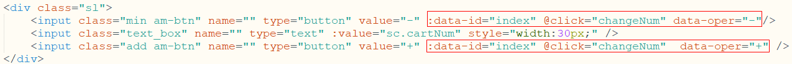 |

- 定义changeNum事件函数

  |                                          |
  | ---------------------------------------- |
  | 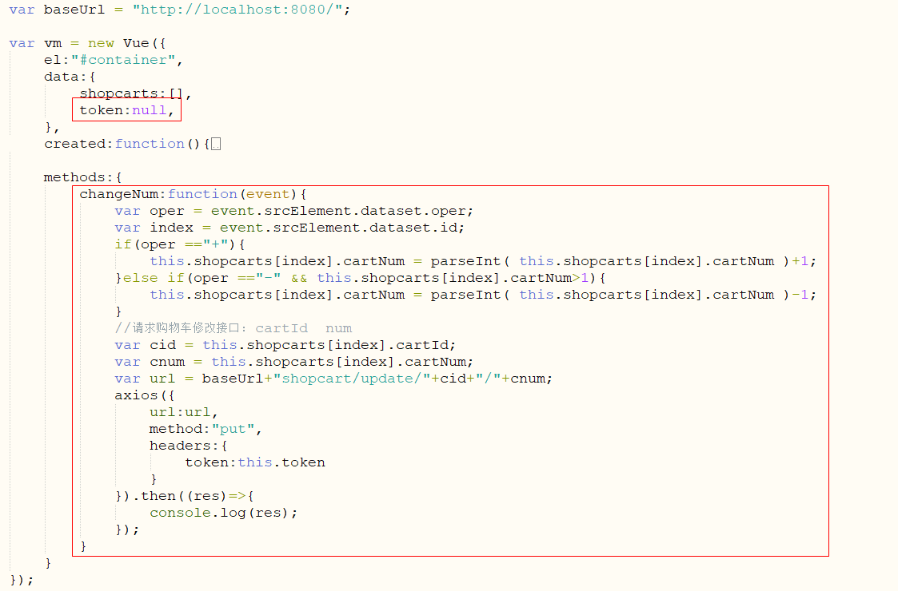 |


## 二十、购物车—结算、提交订单

> 在购物车列表中选择对应的的商品之后，点击提交生成订单的过程

#### 20.1 流程图

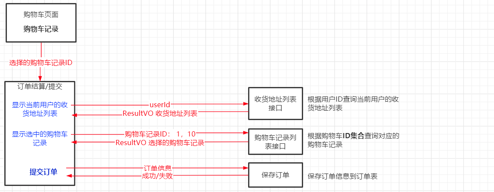

#### 20.2 接口实现

###### 20.2.1 收货地址列表接口

> 此操作的数据库实现可以通过tkmapper通用方法完成

- service接口`UserAddrService`

  ```java
  public interface UserAddrService {
      
      public ResultVO listAddrsByUid(int userId);
      
  }
  ```

- Service实现类 `UserAddrServiceImpl`

  ```java
  @Service
  public class UserAddrServiceImpl implements UserAddrService {
  
      @Autowired
      private UserAddrMapper userAddrMapper;
  
      @Transactional(propagation = Propagation.SUPPORTS)
      public ResultVO listAddrsByUid(int userId) {
          Example example = new Example(UserAddr.class);
          Example.Criteria criteria = example.createCriteria();
          criteria.andEqualTo("userId",userId);
          criteria.andEqualTo("status",1);
          List<UserAddr> userAddrs = userAddrMapper.selectByExample(example);
          ResultVO resultVO = new ResultVO(ResStatus.OK, "success", userAddrs);
          return resultVO;
      }
  }
  ```

- 控制器实现

  ```java
  @RestController
  @CrossOrigin
  @Api(value = "提供收货地址相关接口",tags = "收货地址管理")
  @RequestMapping("/useraddr")
  public class UserAddrController {
  
      @Autowired
      private UserAddrService userAddrService;
  
      @GetMapping("/list")
      @ApiImplicitParam(dataType = "int",name = "userId", value = "用户ID",required = true)
      public ResultVO listAddr(Integer userId, @RequestHeader("token") String token){
          ResultVO resultVO = userAddrService.listAddrsByUid(userId);
          return resultVO;
      }
  
  }
  ```

###### 20.2.2 购物车记录列表接口

> 根据一个ID的集合，查询购物车记录，实现方式有两种：
>
> - 动态sql
>
>   ```xml
>   <select id="searchShoppingCartById" resultMap="shopCartMap">
>       select * from shopping_cart where cart_id in
>       <foreach collection="list" item="cid" separator="," open="(" close=")">
>           #{cid}
>       </foreach>
>   </select>
>   ```
>
> - tkMapper条件查询
>
>   criteria.andIn("cartId",ids);

- Mapper接口定义查询方法

  |                                          |
  | ---------------------------------------- |
  | 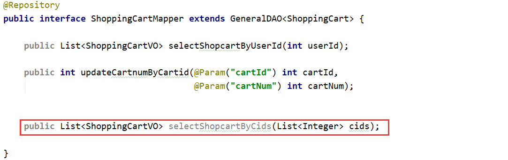 |

- 映射配置(动态sql  foreach)

  | 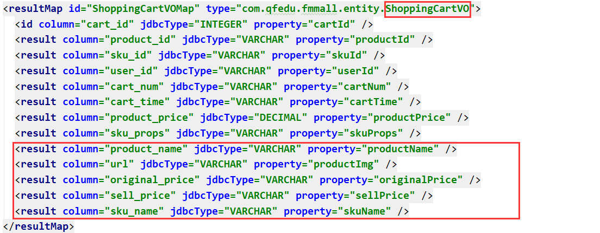 |
  | ---------------------------------------- |
  | 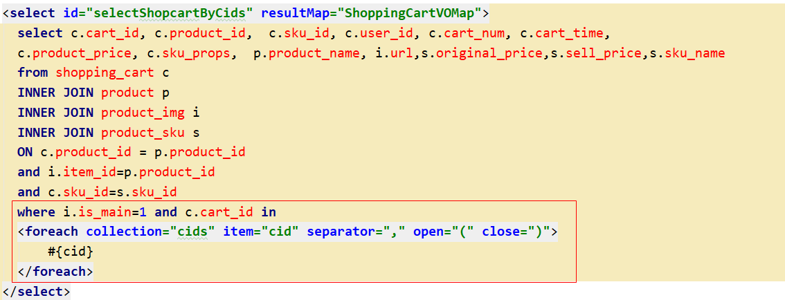 |

- Service接口

  |                                          |
  | ---------------------------------------- |
  | 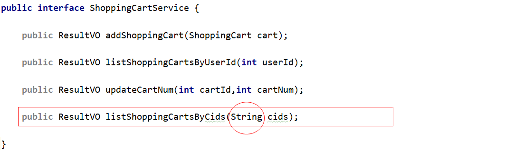 |

- Service实现类

  |                                          |
  | ---------------------------------------- |
  | 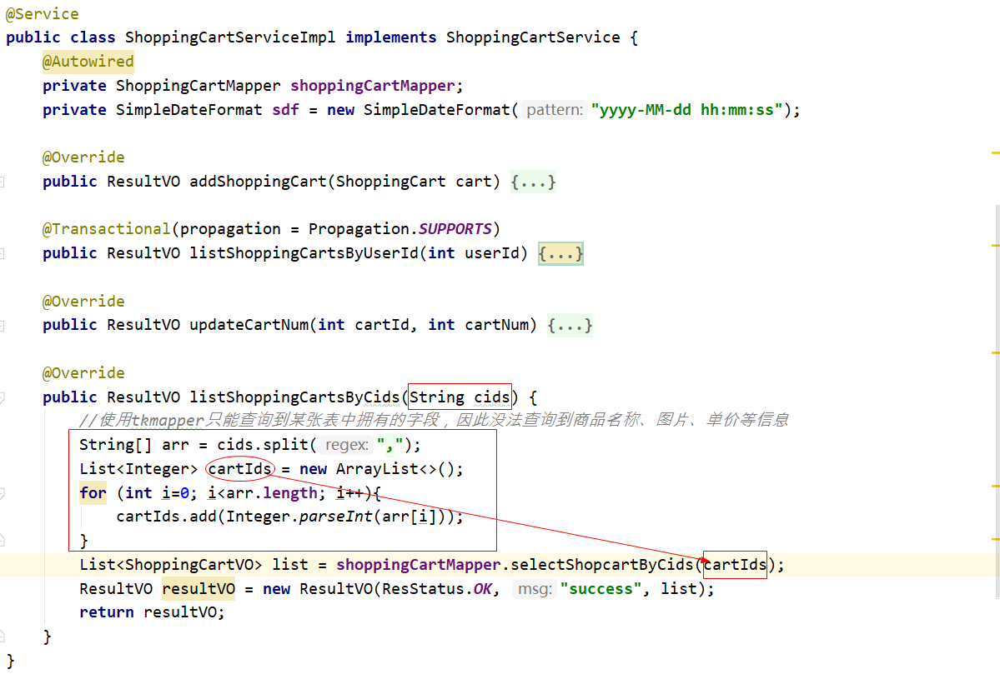 |

- 控制器实现

  ```java
  @GetMapping("/listbycids")
  @ApiImplicitParam(dataType = "String",name = "cids", value = "选择的购物车记录id",required = true)
  public ResultVO listByCids(String cids, @RequestHeader("token")String token){
      ResultVO resultVO = shoppingCartService.listShoppingCartsByCids(cids);
      return resultVO;
  }
  ```

###### 20.2.3 保存订单


#### 20.3 前端实现

###### 20.3.1 选择购物车记录价格联动

- 列表前的复选框标签

  |                                          |
  | ---------------------------------------- |
  | 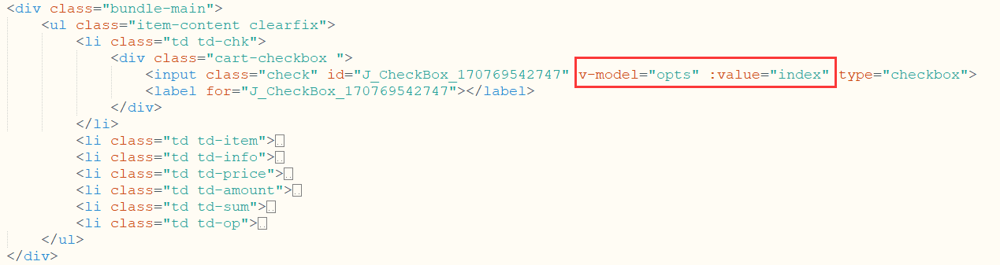 |

- 渲染商品数量以及总价格

  |                                          |
  | ---------------------------------------- |
  | 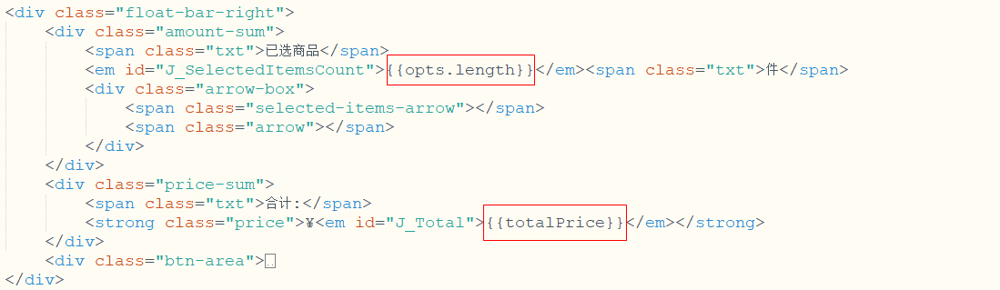 |

- 在vue示例的data中声明opts和totalPrice，并且监听opts选项的改变—选项一旦改变就计算总价格

  |                                          |
  | ---------------------------------------- |
  | 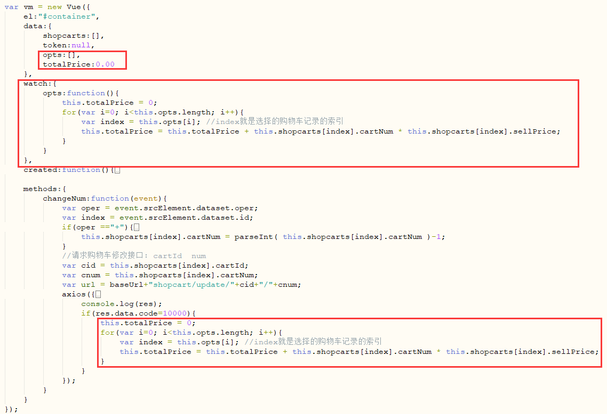 |

###### 20.3.2 点击“结算”跳转到订单添加页面

> 在购物车列表页面，选择购物车记录，点击“结算之后”将选择的购物车记录ID传递到order-add.html

- shopcart.html

  | 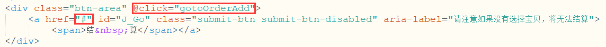 |
  | ---------------------------------------- |
  | 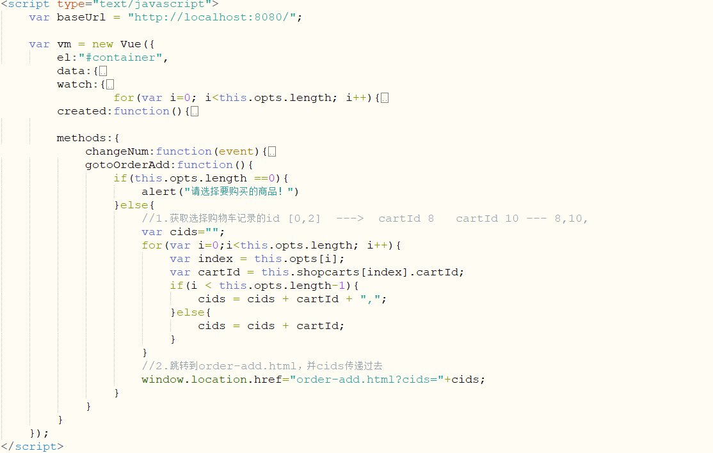 |

- order-add.html

  |                                          |
  | ---------------------------------------- |
  | 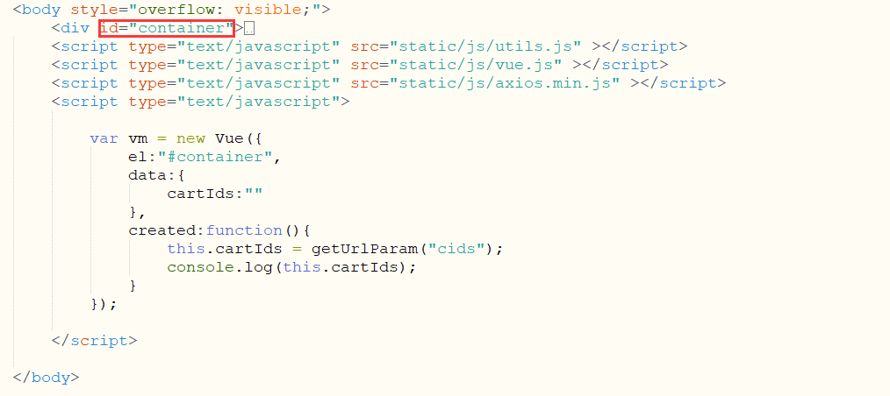 |

###### 20.3.3 显示收货地址及订单商品

###### 20.3.4 订单确认页面选择地址

## 二十一、订单提交及支付

####  21.1 流程分析

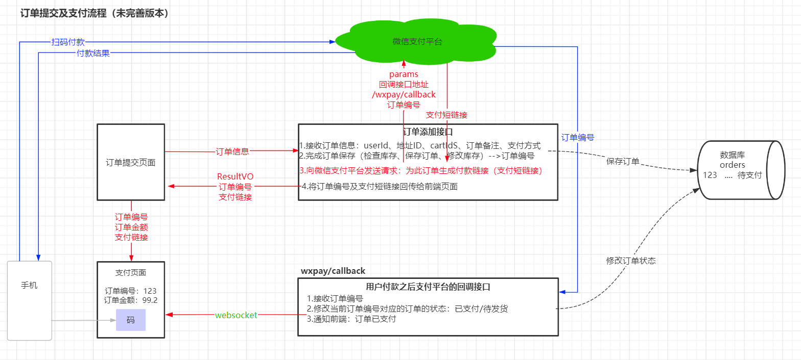

#### 21.2 订单添加接口实现

###### 21.2.1 数据库操作

- 根据收货地址ID，获取收货地址信息（tkMapper）

- 根据购物车ID，查询购物车详情（需要关联查询商品名称、sku名称、`库存`、商品图片、商品价格）

  | 改造：`ShoppingCartMapper`中的`selectShopcartByCids` |
  | ---------------------------------------------------- |
  | 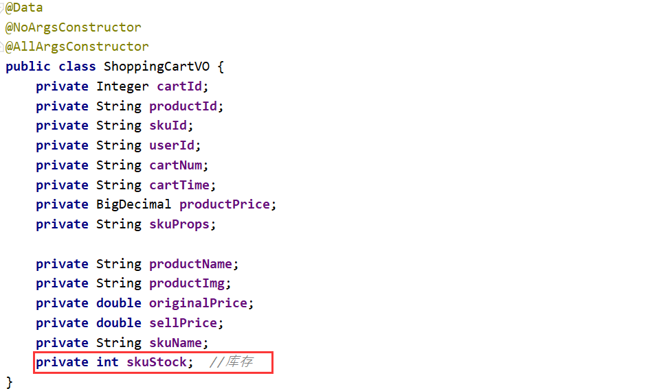             |
  | 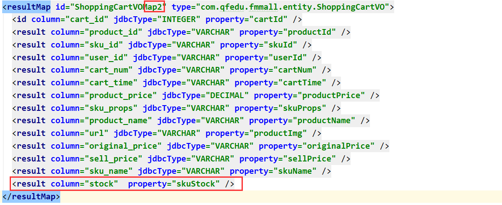             |
  | 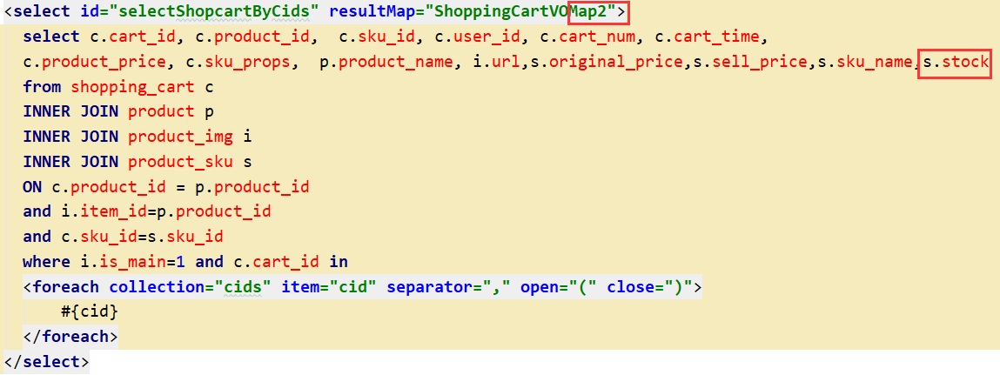             |

- 保存订单（tkMapper）

- 修改库存（tkMapper）

- 保存商品快照（tkMapper）

###### 21.2.2 业务层实现


## 开发任务

#### 1、首页轮播图

#### 2、首页分类列表

#### 3、首页商品推荐

#### 4、首页类别推荐商品

####  5、商品详情

#### 6、商品评价显示


###### 7、实现评价统计及分页

###### 8、购物车